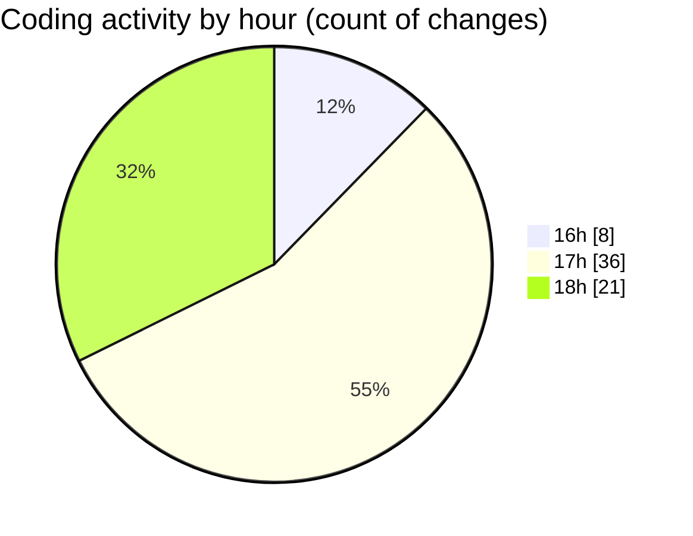

# mbc-web - Activity Summary 

## Overall Statistics

| Stat                   | Value                                                             |
| ---------------------- | ----------------------------------------------------------------- |
| **Lines Added** (➕)   | 1590                                          |
| **Lines Removed** (➖) | 114                                        |
| **Net Change** (↕)    | 1476                |
| **Active Time** (⌚)   | 87 minutes |

## Modified Files
- **index.tsx** (+4, -0)
- **index.css** (+127, -9)
- **_backoffice.tsx** (+11, -1)
- **useInterval.tsx** (+28, -0)
- **banner-carousel.tsx** (+78, -0)
- **package.json** (+66, -1)
- **AppSidebar.tsx** (+208, -100)
- **header.tsx** (+38, -0)
- **header.tsx** (+22, -0)
- **login.tsx** (+42, -0)
- **cadastro.tsx** (+53, -0)
- **footer.tsx** (+16, -0)
- **login.tsx** (+47, -0)
- **sidebar.tsx** (+764, -0)
- **NavMain.tsx** (+86, -3)

## Visualizations

### By File Type (Lines Changed)

### By Hour (Estimated Activity Count)

> **Last Updated:** 08/01/2025, 18:49:22