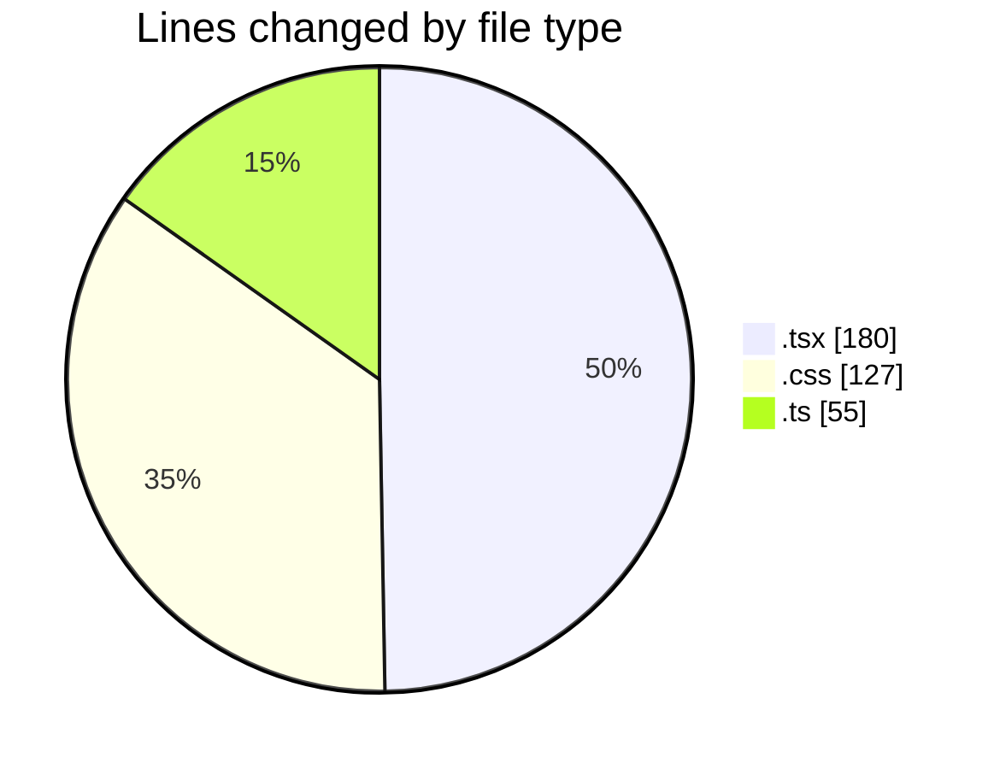
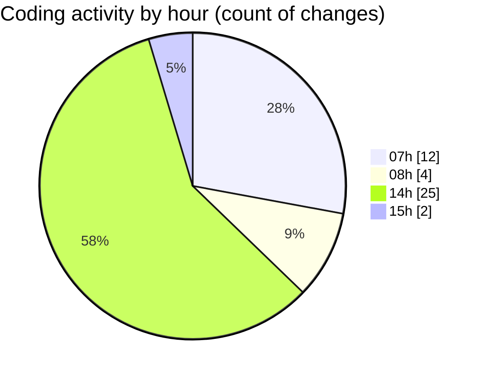

# mbc-web - Activity Summary 

## Overall Statistics

| Stat                   | Value                                                             |
| ---------------------- | ----------------------------------------------------------------- |
| **Lines Added** (➕)   | 340                                          |
| **Lines Removed** (➖) | 22                                        |
| **Net Change** (↕)    | 318                |
| **Active Time** (⌚)   | 64 minutes |

## Modified Files
- **_backoffice.tsx** (+6, -0)
- **user-menu.tsx** (+40, -0)
- **AppSidebar.tsx** (+20, -7)
- **__root.tsx** (+31, -0)
- **link-button.tsx** (+31, -3)
- **index.tsx** (+11, -0)
- **index.tsx** (+19, -4)
- **index.css** (+123, -4)
- **NavMain.tsx** (+4, -4)
- **types.ts** (+55, -0)

## Visualizations

### By File Type (Lines Changed)

### By Hour (Estimated Activity Count)

> **Last Updated:** 09/01/2025, 15:25:20