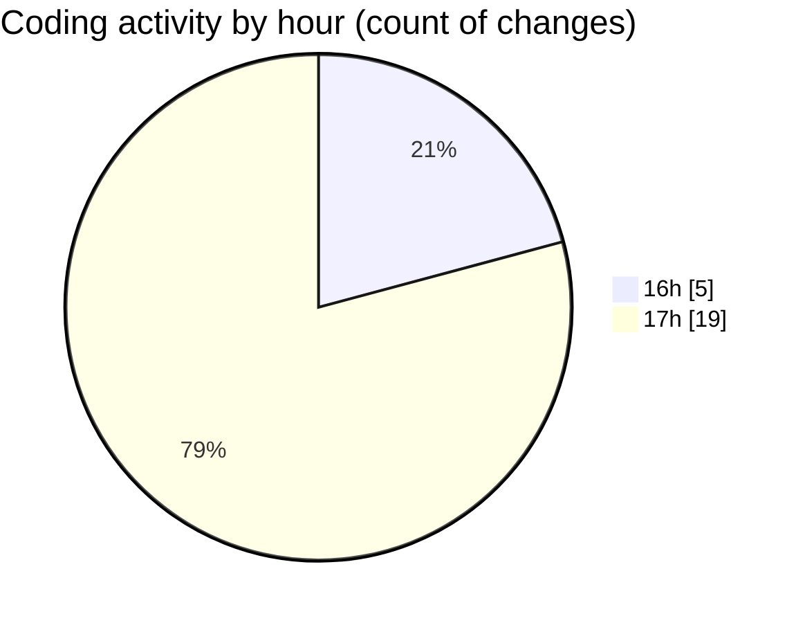

# mbc-web - Activity Summary 

## Overall Statistics

| Stat                   | Value                                                             |
| ---------------------- | ----------------------------------------------------------------- |
| **Lines Added** (➕)   | 91                                          |
| **Lines Removed** (➖) | 119                                        |
| **Net Change** (↕)    | -28                |
| **Active Time** (⌚)   | 32 minutes |

## Modified Files
- **CrudUtils.tsx** (+5, -118)
- **Validator.ts** (+6, -0)
- **index.tsx** (+72, -1)
- **types.ts** (+8, -0)

## Visualizations

### By File Type (Lines Changed)

### By Hour (Estimated Activity Count)

> **Last Updated:** 10/01/2025, 17:35:22