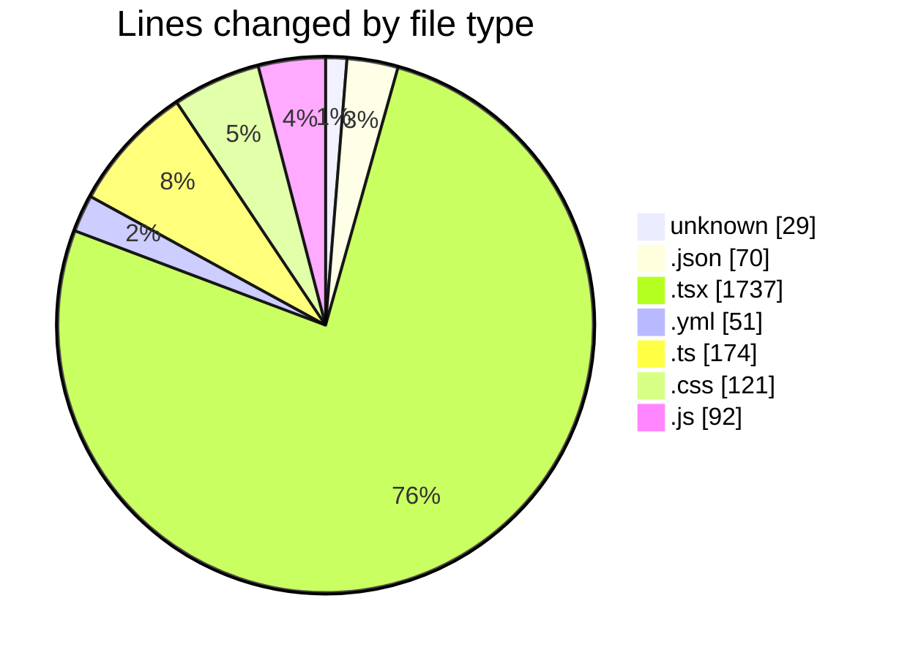
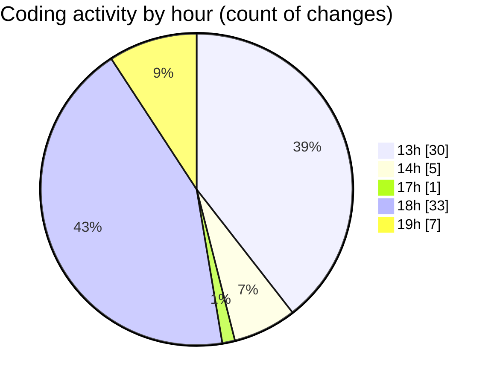

# mbc-web - Activity Summary 

## Overall Statistics

| Stat                   | Value                                                             |
| ---------------------- | ----------------------------------------------------------------- |
| **Lines Added** (➕)   | 2246                                          |
| **Lines Removed** (➖) | 28                                        |
| **Net Change** (↕)    | 2218                |
| **Active Time** (⌚)   | 102 minutes |

## Modified Files
- **.gitignore** (+27, -2)
- **package.json** (+69, -1)
- **AppSidebar.tsx** (+80, -3)
- **CrudUtils.tsx** (+265, -0)
- **index.tsx** (+424, -1)
- **index.tsx** (+112, -7)
- **order-summary.tsx** (+85, -0)
- **NavMain.tsx** (+83, -1)
- **radio-group.tsx** (+42, -1)
- **selos.lazy.tsx** (+20, -0)
- **pesquisa.lazy.tsx** (+85, -0)
- **desejos.lazy.tsx** (+100, -0)
- **index.lazy.tsx** (+40, -0)
- **login.tsx** (+44, -1)
- **homoloh.yml** (+49, -2)
- **pesquisa.tsx** (+85, -0)
- **CrudFilter.tsx** (+112, -9)
- **types.ts** (+174, -0)
- **index.tsx** (+75, -0)
- **button.tsx** (+62, -0)
- **index.css** (+121, -0)
- **tailwind.config.js** (+92, -0)

## Visualizations

### By File Type (Lines Changed)

### By Hour (Estimated Activity Count)

> **Last Updated:** 14/01/2025, 19:23:17