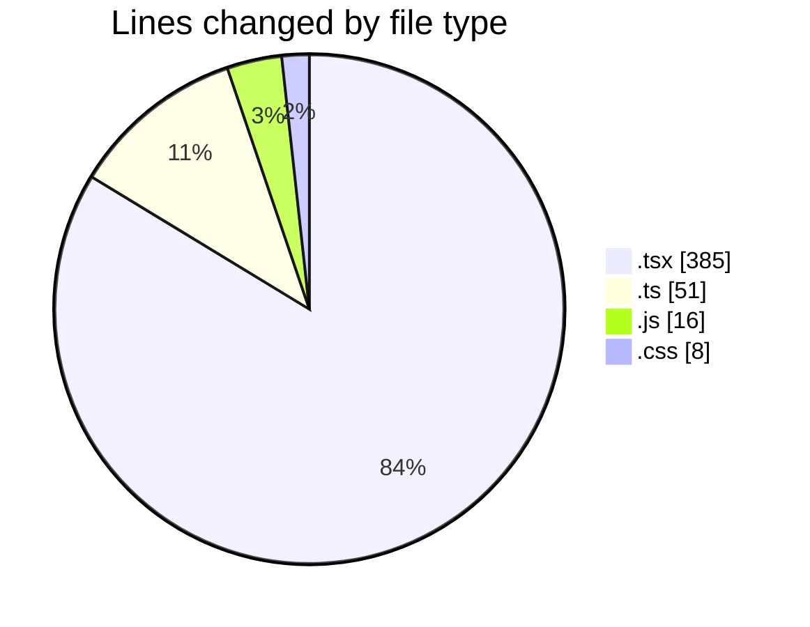

# mbc-web - Activity Summary 

## Overall Statistics

| Stat                   | Value                                                             |
| ---------------------- | ----------------------------------------------------------------- |
| **Lines Added** (➕)   | 385                                          |
| **Lines Removed** (➖) | 75                                        |
| **Net Change** (↕)    | 310                |
| **Active Time** (⌚)   | 41 minutes |

## Modified Files
- **index.tsx** (+47, -48)
- **index.tsx** (+2, -2)
- **types.ts** (+2, -2)
- **tailwind.config.js** (+8, -8)
- **index.css** (+4, -4)
- **usuarios.tsx** (+98, -0)
- **usuarios.tsx** (+95, -0)
- **index.tsx** (+93, -0)
- **config.ts** (+12, -0)
- **_config.ts** (+12, -0)
- **-config.ts** (+12, -11)

## Visualizations

### By File Type (Lines Changed)

### By Hour (Estimated Activity Count)

> **Last Updated:** 17/01/2025, 07:16:40