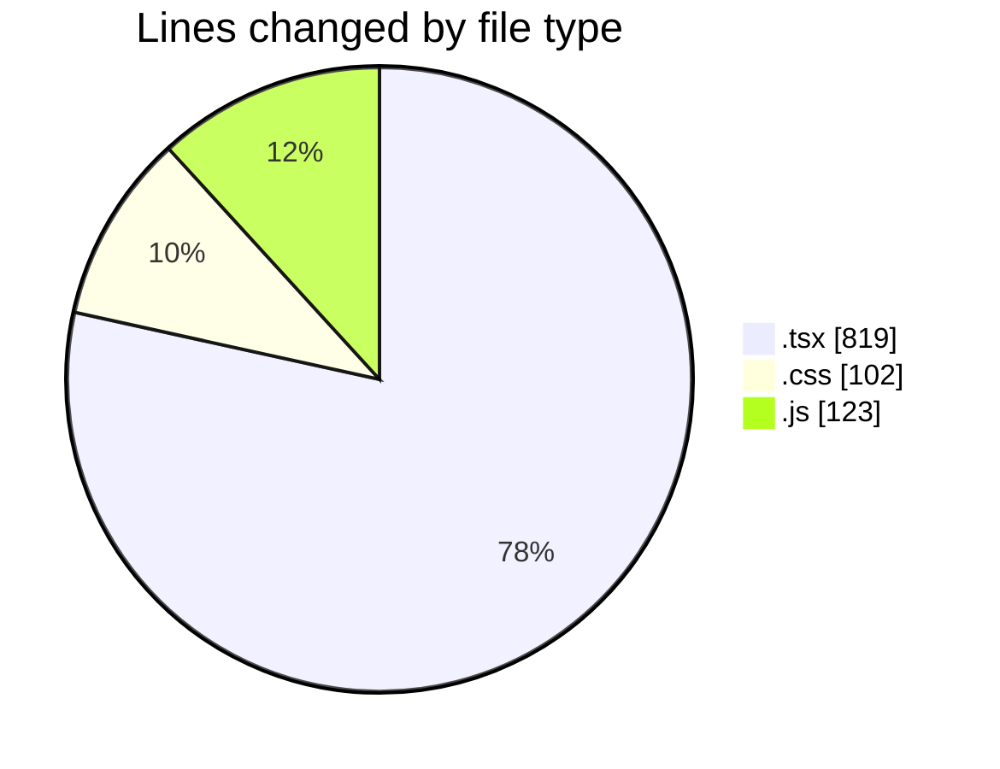

# mbc-web - Activity Summary 

## Overall Statistics

| Stat                   | Value                                                             |
| ---------------------- | ----------------------------------------------------------------- |
| **Lines Added** (➕)   | 1019                                          |
| **Lines Removed** (➖) | 25                                        |
| **Net Change** (↕)    | 994                |
| **Active Time** (⌚)   | 51 minutes |

## Modified Files
- **StatusBar.tsx** (+73, -11)
- **Tabs.tsx** (+48, -0)
- **Content.tsx** (+22, -0)
- **Tabs.tsx** (+50, -3)
- **List.tsx** (+29, -0)
- **Trigger.tsx** (+30, -0)
- **CrudRecordForm.tsx** (+0, -5)
- **index.tsx** (+429, -5)
- **StatusBar.module.css** (+40, -0)
- **tailwind.config.js** (+122, -1)
- **Tabs.module.css** (+17, -0)
- **Select.module.css** (+9, -0)
- **index.tsx** (+72, -0)
- **SideOver.tsx** (+42, -0)
- **Input.module.css** (+36, -0)

## Visualizations

### By File Type (Lines Changed)

### By Hour (Estimated Activity Count)

> **Last Updated:** 17/01/2025, 18:37:04