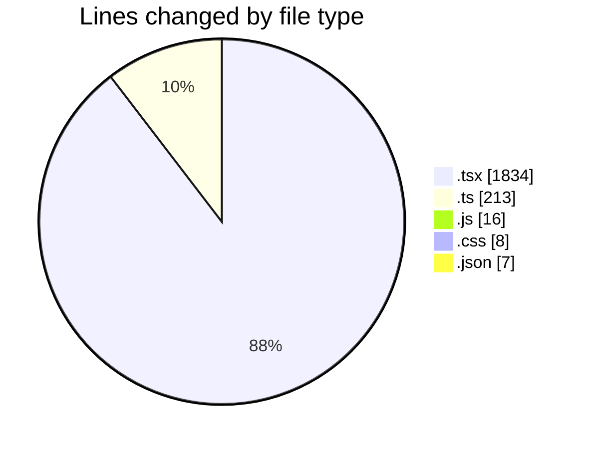
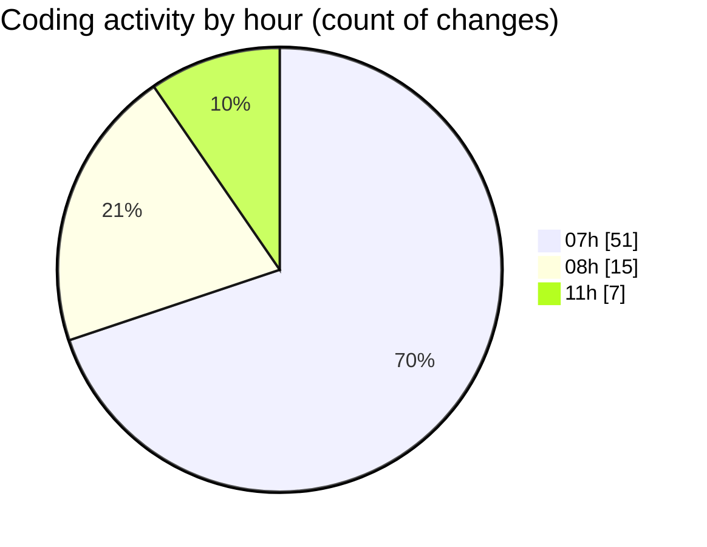

# mbc-web - Activity Summary 

## Overall Statistics

| Stat                   | Value                                                             |
| ---------------------- | ----------------------------------------------------------------- |
| **Lines Added** (➕)   | 1980                                          |
| **Lines Removed** (➖) | 98                                        |
| **Net Change** (↕)    | 1882                |
| **Active Time** (⌚)   | 94 minutes |

## Modified Files
- **index.tsx** (+56, -61)
- **index.tsx** (+2, -2)
- **types.ts** (+2, -2)
- **tailwind.config.js** (+8, -8)
- **index.css** (+4, -4)
- **usuarios.tsx** (+98, -0)
- **usuarios.tsx** (+95, -0)
- **index.tsx** (+117, -0)
- **config.ts** (+12, -0)
- **_config.ts** (+12, -0)
- **-config.ts** (+170, -15)
- **CrudRecordForm.tsx** (+1353, -4)
- **Sideover.tsx** (+44, -2)
- **settings.json** (+7, -0)

## Visualizations

### By File Type (Lines Changed)

### By Hour (Estimated Activity Count)

> **Last Updated:** 17/01/2025, 11:30:18