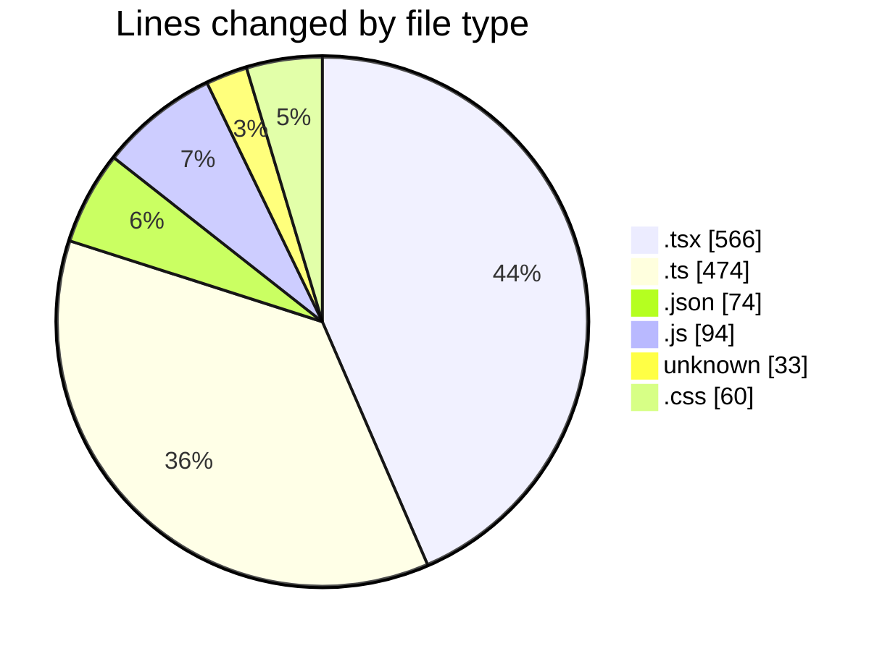
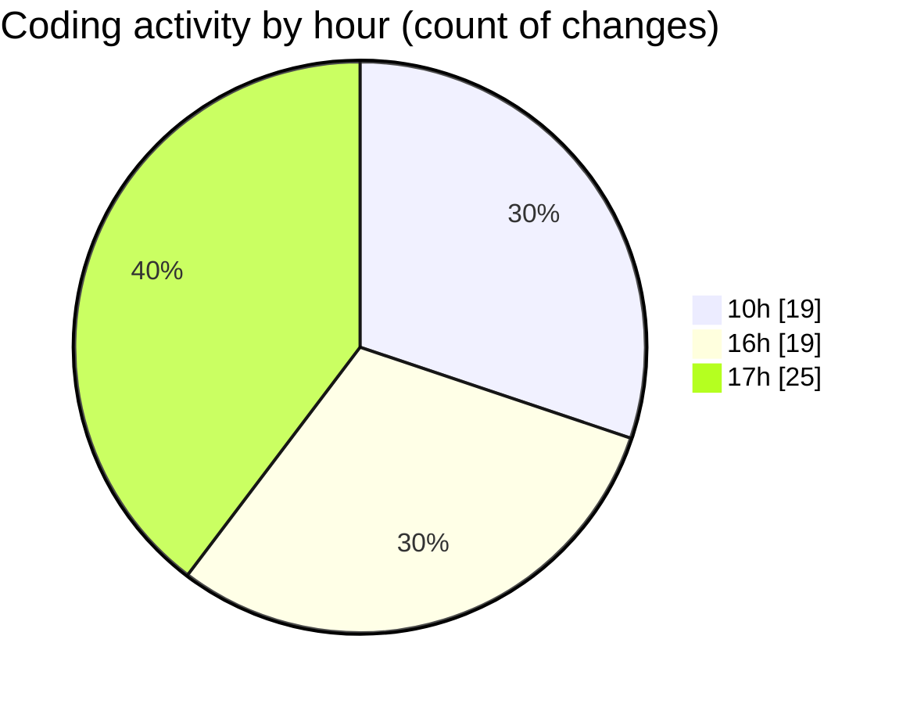

# mbc-web - Activity Summary 

## Overall Statistics

| Stat                   | Value                                                             |
| ---------------------- | ----------------------------------------------------------------- |
| **Lines Added** (➕)   | 1096                                          |
| **Lines Removed** (➖) | 205                                        |
| **Net Change** (↕)    | 891                |
| **Active Time** (⌚)   | 82 minutes |

## Modified Files
- **index.tsx** (+60, -3)
- **-config.ts** (+108, -0)
- **AppSidebar.tsx** (+77, -0)
- **-config.ts** (+169, -0)
- **package.json** (+73, -1)
- **Validator.ts** (+197, -0)
- **tailwind.config.js** (+47, -47)
- **index.tsx** (+123, -123)
- **RenderViewField.tsx** (+0, -3)
- **index.tsx** (+1, -0)
- **CrudFilter.tsx** (+105, -6)
- **RenderInputField.tsx** (+1, -2)
- **SideOver.tsx** (+7, -14)
- **CrudUtils.tsx** (+1, -1)
- **Badge** (+33, -0)
- **Badge.tsx** (+34, -5)
- **Badge.module.css** (+60, -0)

## Visualizations

### By File Type (Lines Changed)

### By Hour (Estimated Activity Count)

> **Last Updated:** 20/01/2025, 17:50:03