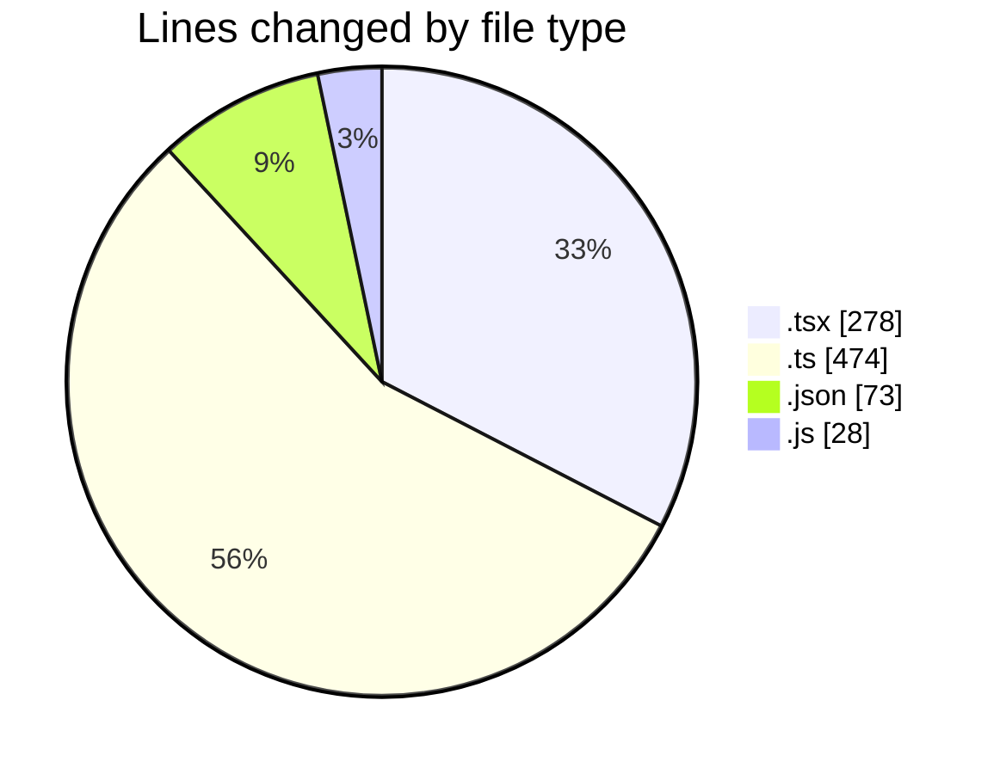
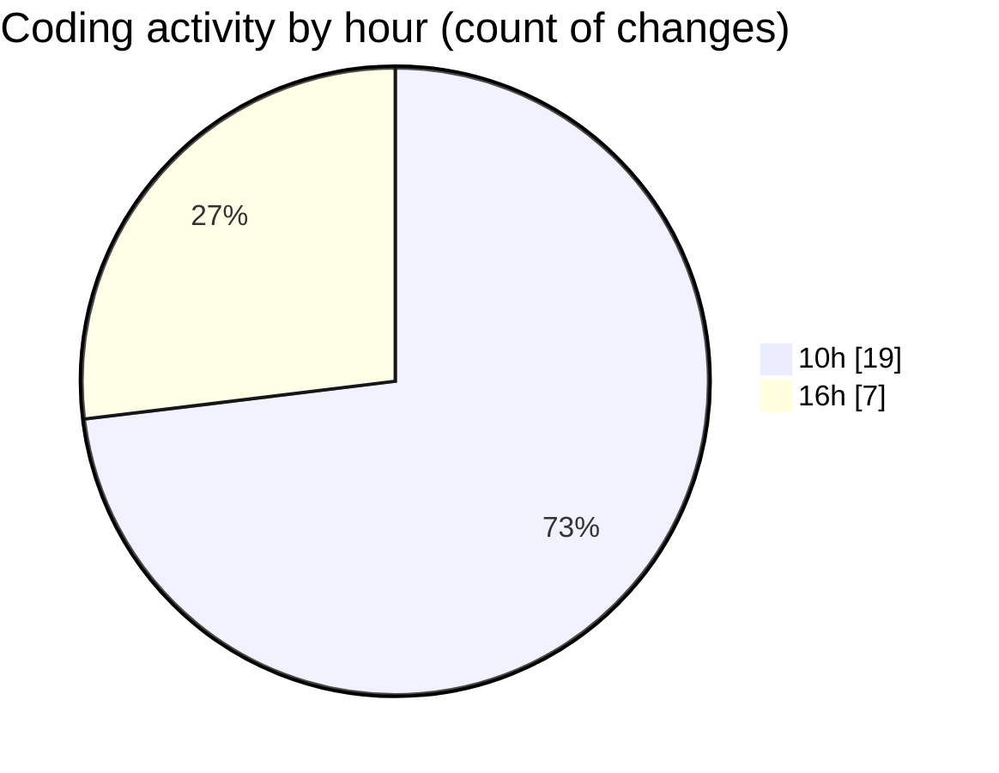

# mbc-web - Activity Summary 

## Overall Statistics

| Stat                   | Value                                                             |
| ---------------------- | ----------------------------------------------------------------- |
| **Lines Added** (➕)   | 767                                          |
| **Lines Removed** (➖) | 86                                        |
| **Net Change** (↕)    | 681                |
| **Active Time** (⌚)   | 29 minutes |

## Modified Files
- **index.tsx** (+60, -3)
- **-config.ts** (+108, -0)
- **AppSidebar.tsx** (+77, -0)
- **-config.ts** (+169, -0)
- **package.json** (+73, -0)
- **Validator.ts** (+197, -0)
- **tailwind.config.js** (+14, -14)
- **index.tsx** (+69, -69)

## Visualizations

### By File Type (Lines Changed)

### By Hour (Estimated Activity Count)

> **Last Updated:** 20/01/2025, 16:55:03