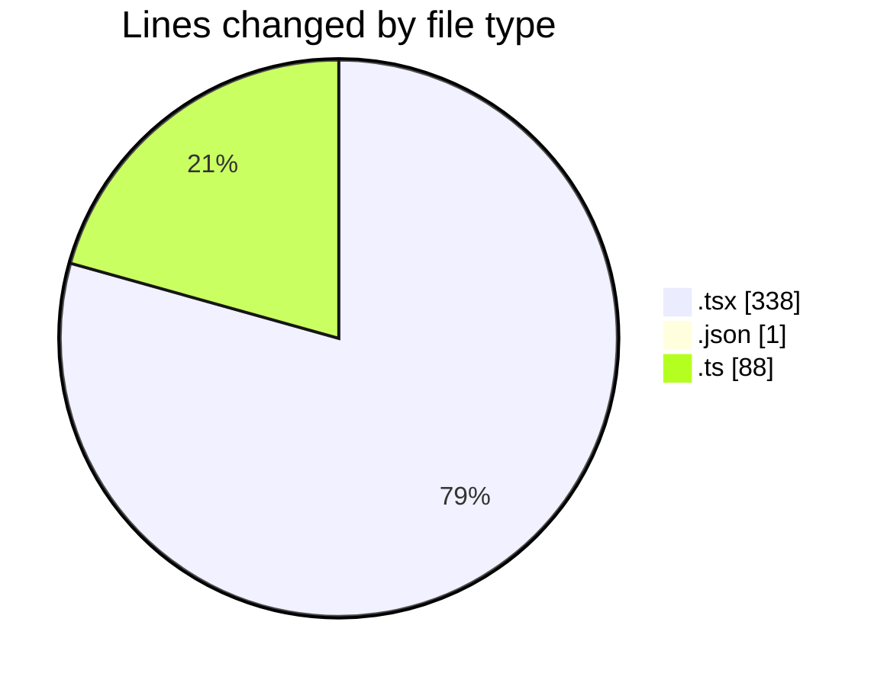
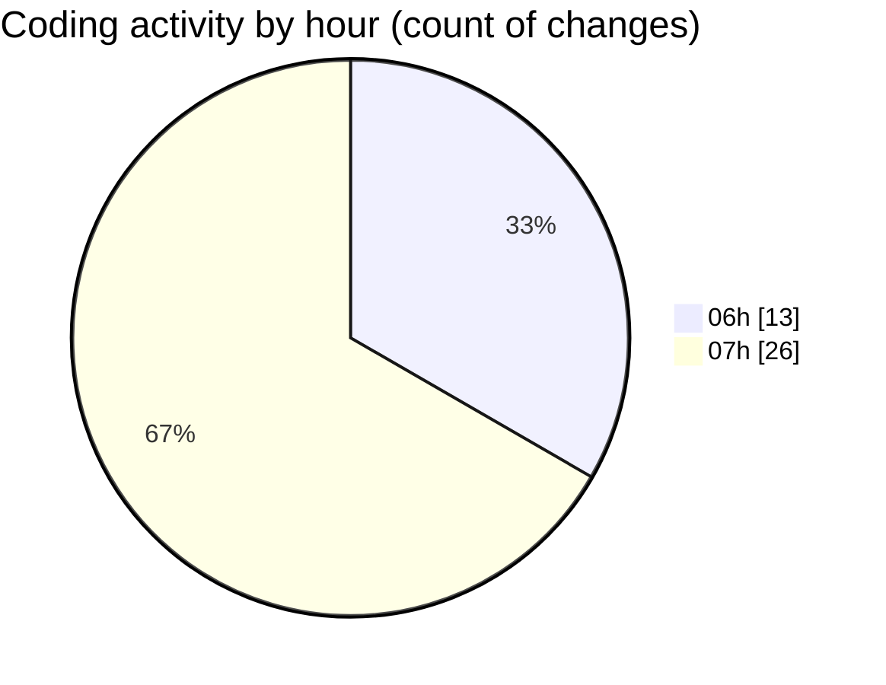

# mbc-web - Activity Summary 

## Overall Statistics

| Stat                   | Value                                                             |
| ---------------------- | ----------------------------------------------------------------- |
| **Lines Added** (➕)   | 409                                          |
| **Lines Removed** (➖) | 18                                        |
| **Net Change** (↕)    | 391                |
| **Active Time** (⌚)   | 55 minutes |

## Modified Files
- **main.tsx** (+32, -0)
- **index.tsx** (+3, -0)
- **index.tsx** (+6, -0)
- **_backoffice.tsx** (+27, -7)
- **Header.tsx** (+23, -2)
- **AppSidebar.tsx** (+2, -0)
- **package.json** (+0, -1)
- **index.tsx** (+3, -0)
- **-config.ts** (+79, -0)
- **RenderViewField.tsx** (+14, -2)
- **RenderInputField.tsx** (+1, -0)
- **TableField.tsx** (+210, -6)
- **IdHelper.ts** (+9, -0)

## Visualizations

### By File Type (Lines Changed)

### By Hour (Estimated Activity Count)

> **Last Updated:** 21/01/2025, 07:23:09