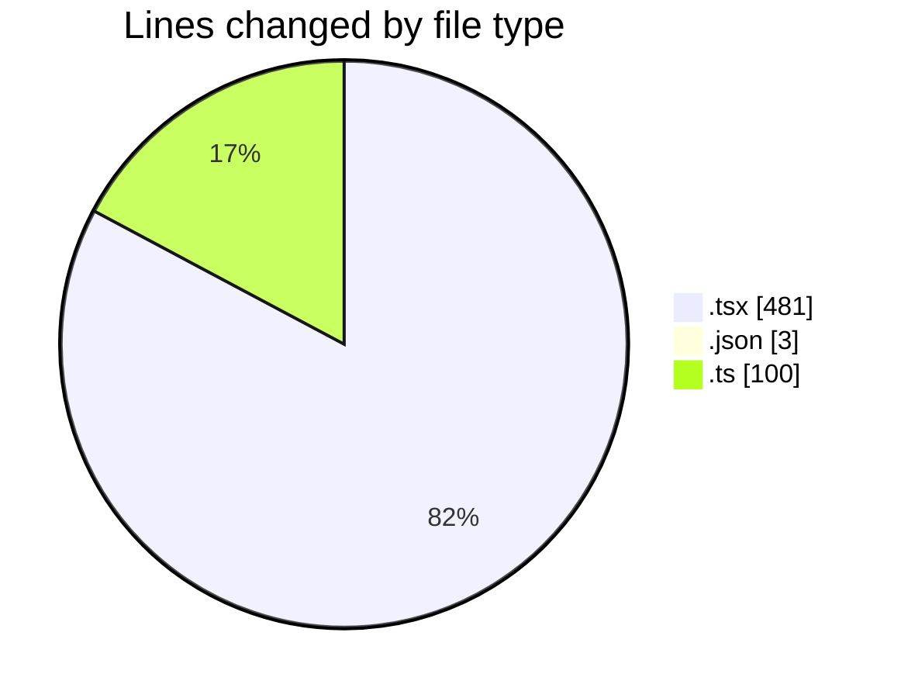
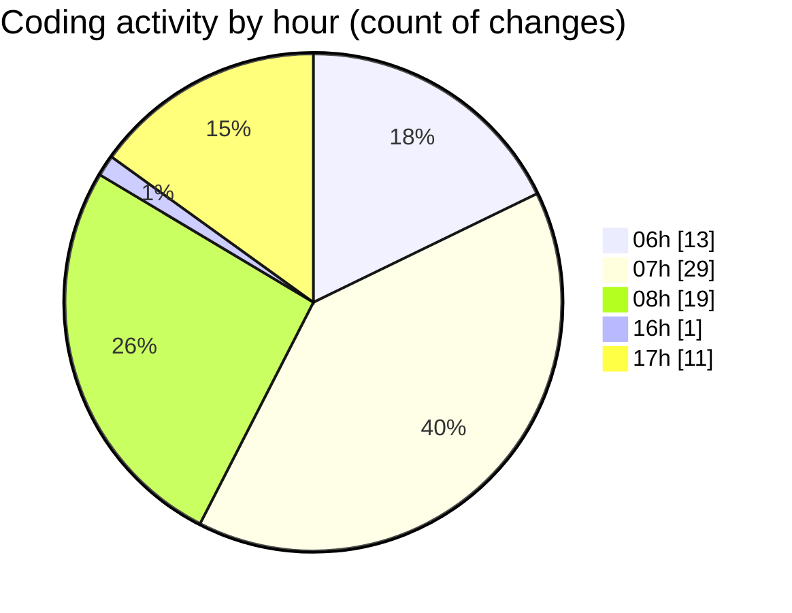

# mbc-web - Activity Summary 

## Overall Statistics

| Stat                   | Value                                                             |
| ---------------------- | ----------------------------------------------------------------- |
| **Lines Added** (➕)   | 545                                          |
| **Lines Removed** (➖) | 39                                        |
| **Net Change** (↕)    | 506                |
| **Active Time** (⌚)   | 107 minutes |

## Modified Files
- **main.tsx** (+32, -0)
- **index.tsx** (+3, -0)
- **index.tsx** (+20, -10)
- **_backoffice.tsx** (+27, -7)
- **Header.tsx** (+23, -2)
- **AppSidebar.tsx** (+2, -0)
- **package.json** (+1, -2)
- **index.tsx** (+5, -0)
- **-config.ts** (+80, -0)
- **RenderViewField.tsx** (+49, -3)
- **RenderInputField.tsx** (+42, -0)
- **TableField.tsx** (+211, -7)
- **IdHelper.ts** (+9, -0)
- **CrudRecordForm.tsx** (+4, -3)
- **types.ts** (+1, -0)
- **__root.tsx** (+31, -0)
- **-config.ts** (+5, -5)

## Visualizations

### By File Type (Lines Changed)

### By Hour (Estimated Activity Count)

> **Last Updated:** 21/01/2025, 17:41:19