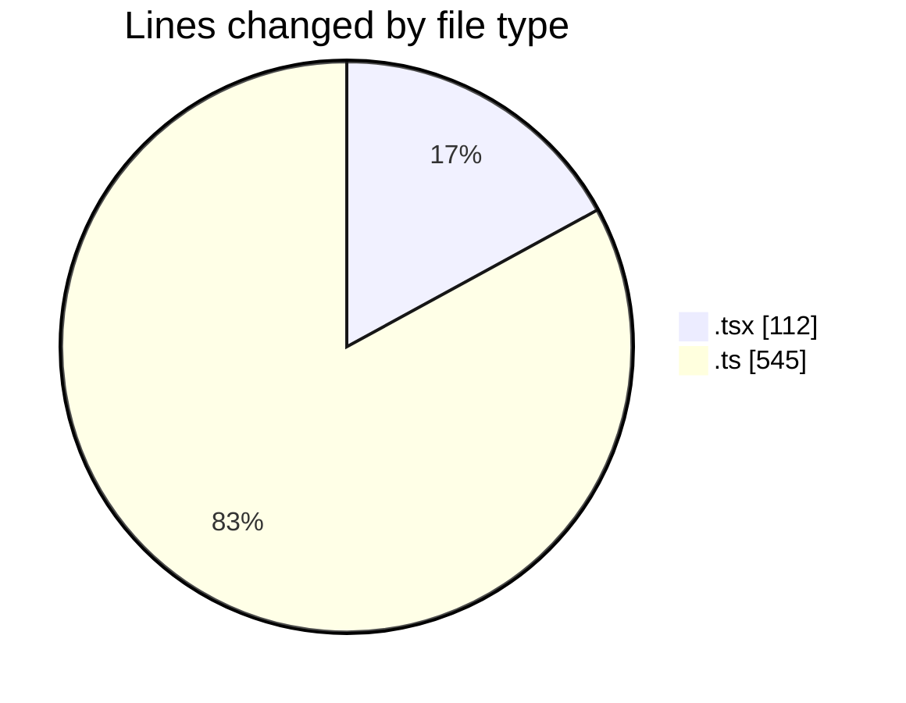
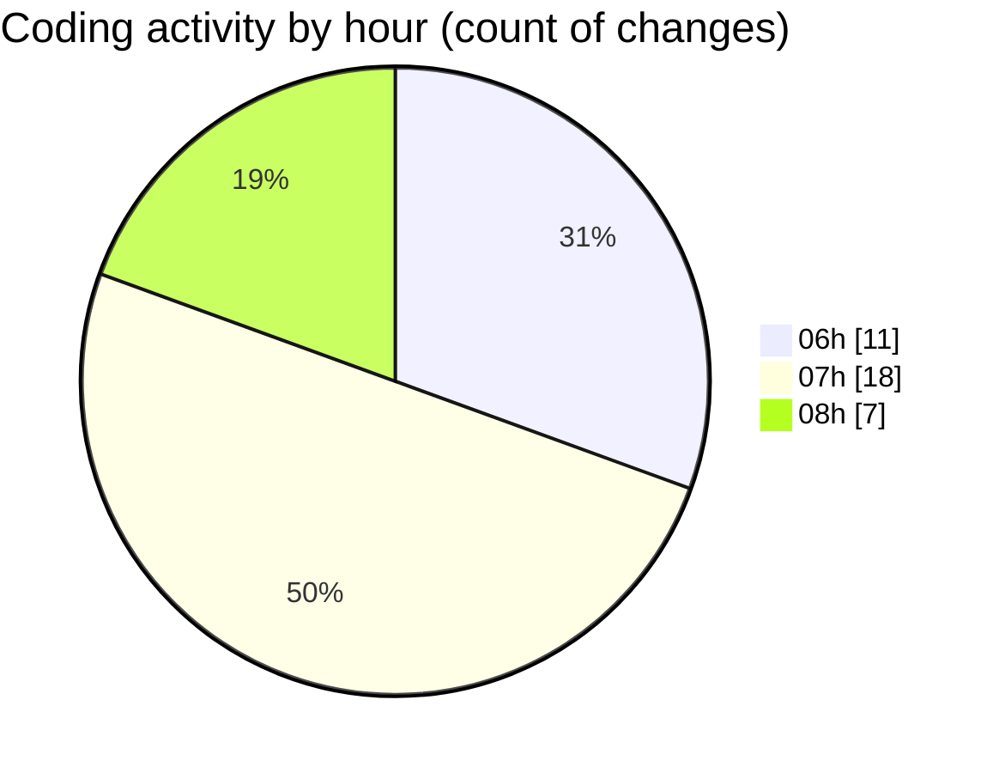

# mbc-web - Activity Summary 

## Overall Statistics

| Stat                   | Value                                                             |
| ---------------------- | ----------------------------------------------------------------- |
| **Lines Added** (➕)   | 554                                          |
| **Lines Removed** (➖) | 103                                        |
| **Net Change** (↕)    | 451                |
| **Active Time** (⌚)   | 44 minutes |

## Modified Files
- **CrudRecordForm.tsx** (+0, -1)
- **-config.ts** (+5, -0)
- **index.tsx** (+71, -12)
- **-config.ts** (+451, -88)
- **RenderViewField.tsx** (+14, -2)
- **types.ts** (+1, -0)
- **CrudUtils.tsx** (+12, -0)

## Visualizations

### By File Type (Lines Changed)

### By Hour (Estimated Activity Count)

> **Last Updated:** 22/01/2025, 08:08:36