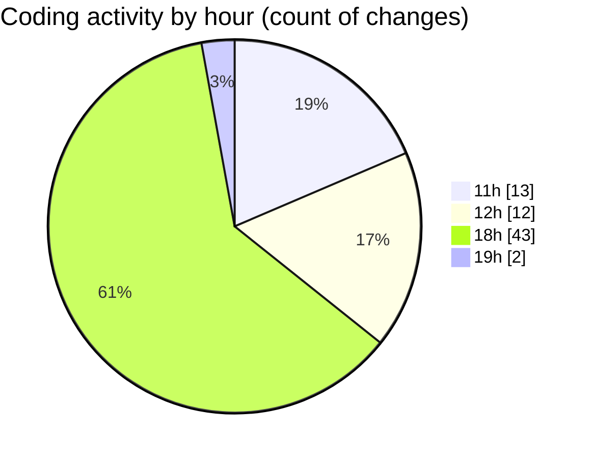

# termonied-web - Activity Summary 

## Overall Statistics

| Stat                   | Value                                                             |
| ---------------------- | ----------------------------------------------------------------- |
| **Lines Added** (➕)   | 4051                                          |
| **Lines Removed** (➖) | 176                                        |
| **Net Change** (↕)    | 3875                |
| **Active Time** (⌚)   | 102 minutes |

## Modified Files
- **middleware.ts** (+78, -4)
- **page.tsx** (+343, -109)
- **dialog.tsx** (+123, -0)
- **index.jsx** (+172, -0)
- **index.jsx** (+171, -0)
- **index.jsx** (+69, -0)
- **index.tsx** (+138, -0)
- **index.jsx** (+114, -2)
- **Input.tsx** (+139, -2)
- **package.json** (+73, -0)
- **Select.tsx** (+57, -1)
- **CrudRecordForm.tsx** (+436, -0)
- **Validator.ts** (+197, -0)
- **CrudUtils.tsx** (+303, -2)
- **index.tsx** (+461, -2)
- **RenderInputField.tsx** (+288, -0)
- **RenderViewField.tsx** (+146, -0)
- **page.tsx** (+133, -2)
- **config.ts** (+175, -52)
- **tailwind.config.ts** (+112, -0)
- **TableField.tsx** (+204, -0)
- **IdHelper.ts** (+9, -0)
- **layout.tsx** (+110, -0)

## Visualizations

### By File Type (Lines Changed)

### By Hour (Estimated Activity Count)

> **Last Updated:** 25/01/2025, 19:03:30