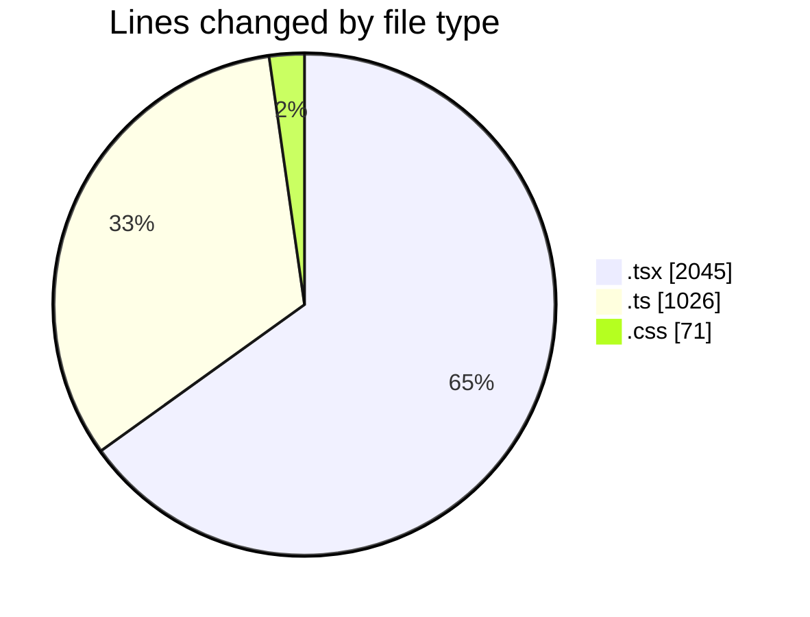
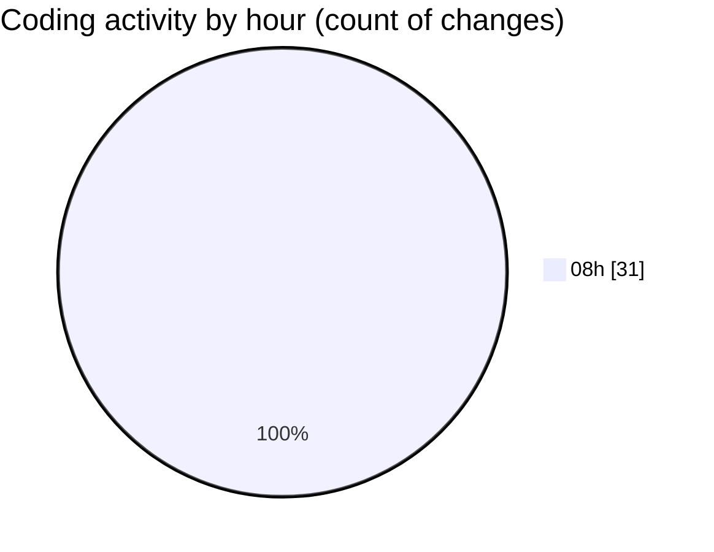

# mbc-web - Activity Summary 

## Overall Statistics

| Stat                   | Value                                                             |
| ---------------------- | ----------------------------------------------------------------- |
| **Lines Added** (➕)   | 3130                                          |
| **Lines Removed** (➖) | 12                                        |
| **Net Change** (↕)    | 3118                |
| **Active Time** (⌚)   | 38 minutes |

## Modified Files
- **index.tsx** (+102, -0)
- **-config.ts** (+829, -0)
- **-config.tsx** (+875, -8)
- **CrudUtils.tsx** (+303, -1)
- **Badge.tsx** (+29, -0)
- **Badge.module.css** (+70, -1)
- **-config.ts** (+197, -0)
- **-config.tsx** (+198, -2)
- **index.tsx** (+68, -0)
- **index.tsx** (+459, -0)

## Visualizations

### By File Type (Lines Changed)

### By Hour (Estimated Activity Count)

> **Last Updated:** 27/01/2025, 08:42:52