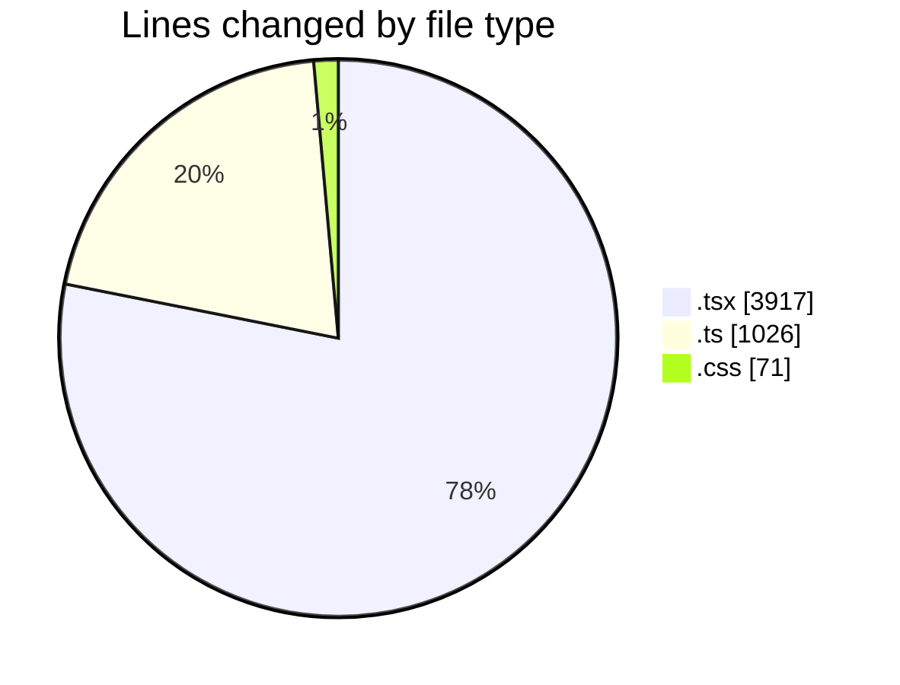
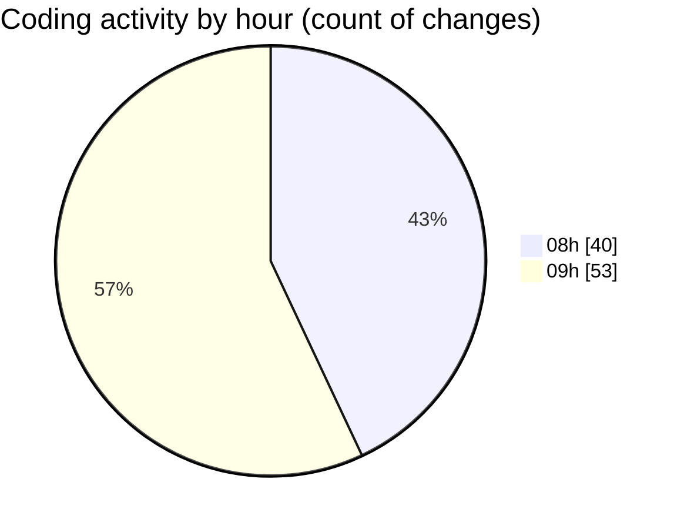

# mbc-web - Activity Summary 

## Overall Statistics

| Stat                   | Value                                                             |
| ---------------------- | ----------------------------------------------------------------- |
| **Lines Added** (➕)   | 4771                                          |
| **Lines Removed** (➖) | 243                                        |
| **Net Change** (↕)    | 4528                |
| **Active Time** (⌚)   | 125 minutes |

## Modified Files
- **index.tsx** (+111, -0)
- **-config.ts** (+829, -0)
- **-config.tsx** (+875, -8)
- **CrudUtils.tsx** (+313, -1)
- **Badge.tsx** (+29, -0)
- **Badge.module.css** (+70, -1)
- **-config.ts** (+197, -0)
- **-config.tsx** (+198, -2)
- **index.tsx** (+68, -0)
- **index.tsx** (+463, -5)
- **CrudDeleteModal.tsx** (+188, -37)
- **SideOver.tsx** (+48, -0)
- **index.tsx** (+116, -2)
- **-config.tsx** (+885, -185)
- **AppSidebar.tsx** (+79, -0)
- **RenderInputField.tsx** (+302, -2)

## Visualizations

### By File Type (Lines Changed)

### By Hour (Estimated Activity Count)

> **Last Updated:** 27/01/2025, 09:52:52