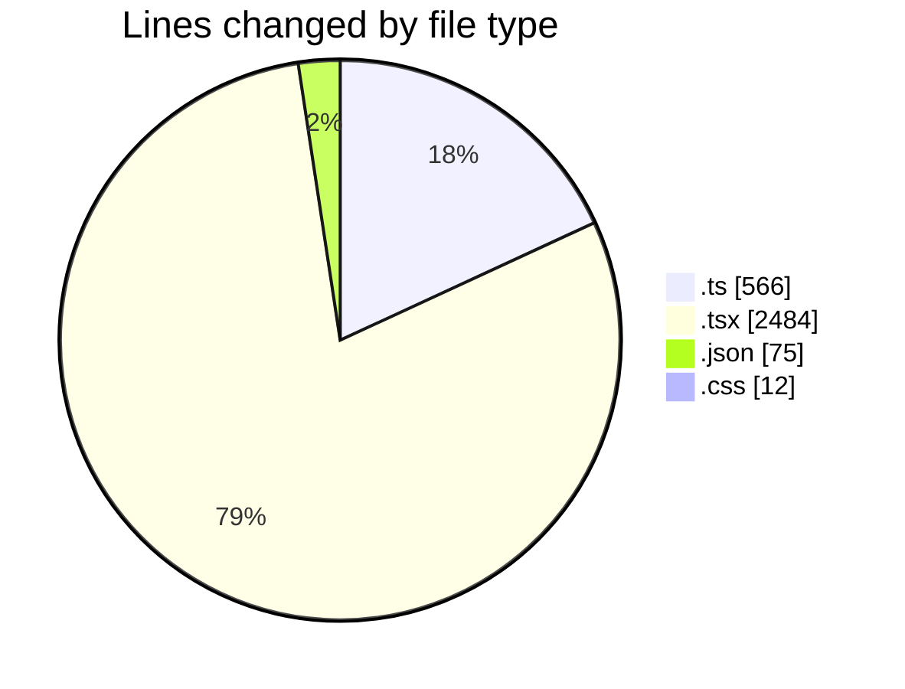
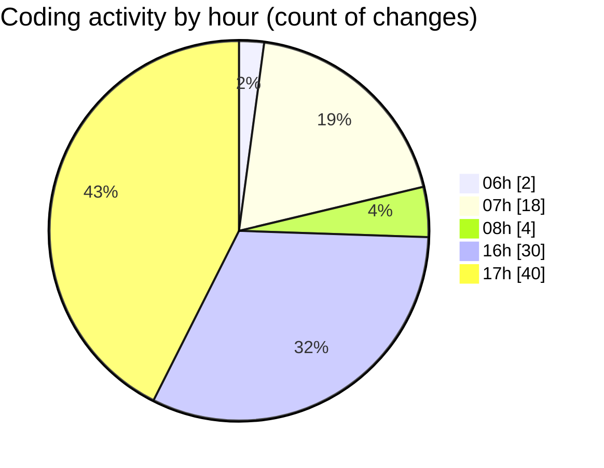

# termonied-web - Activity Summary 

## Overall Statistics

| Stat                   | Value                                                             |
| ---------------------- | ----------------------------------------------------------------- |
| **Lines Added** (➕)   | 3026                                          |
| **Lines Removed** (➖) | 111                                        |
| **Net Change** (↕)    | 2915                |
| **Active Time** (⌚)   | 152 minutes |

## Modified Files
- **types.ts** (+372, -0)
- **page.tsx** (+94, -93)
- **config.ts** (+189, -5)
- **CrudFilter.tsx** (+279, -9)
- **RenderInputField.tsx** (+472, -1)
- **index.tsx** (+464, -0)
- **CrudRecordForm.tsx** (+442, -3)
- **package.json** (+75, -0)
- **Autocomplete.tsx** (+179, -0)
- **AutoComplete.module.css** (+12, -0)
- **RenderViewField.tsx** (+147, -0)
- **CrudUtils.tsx** (+301, -0)

## Visualizations

### By File Type (Lines Changed)

### By Hour (Estimated Activity Count)

> **Last Updated:** 27/01/2025, 17:46:39