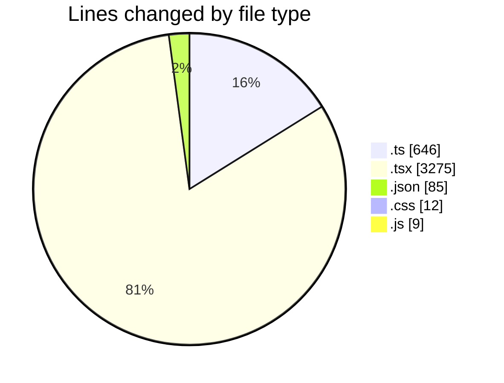
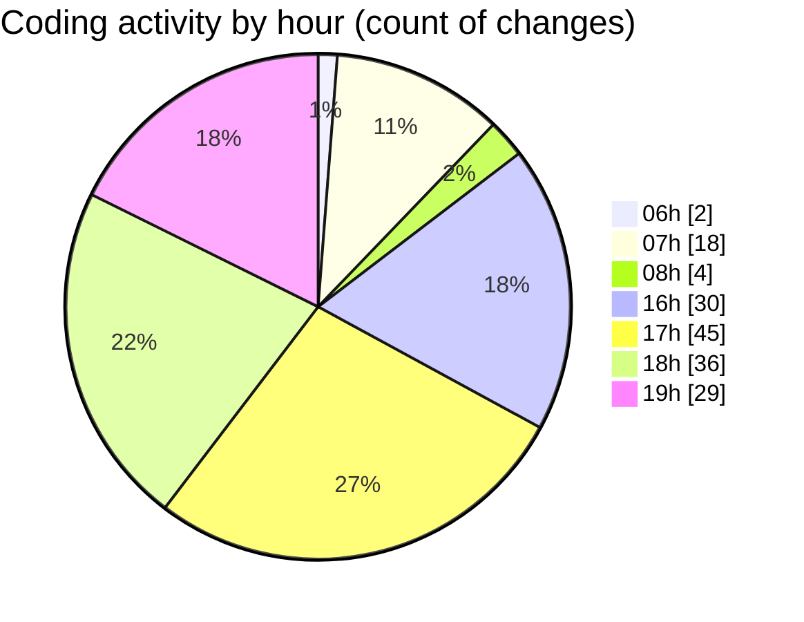

# termonied-web - Activity Summary 

## Overall Statistics

| Stat                   | Value                                                             |
| ---------------------- | ----------------------------------------------------------------- |
| **Lines Added** (➕)   | 3707                                          |
| **Lines Removed** (➖) | 320                                        |
| **Net Change** (↕)    | 3387                |
| **Active Time** (⌚)   | 288 minutes |

## Modified Files
- **types.ts** (+373, -0)
- **page.tsx** (+113, -97)
- **config.ts** (+207, -10)
- **CrudFilter.tsx** (+279, -9)
- **RenderInputField.tsx** (+472, -1)
- **index.tsx** (+465, -0)
- **CrudRecordForm.tsx** (+452, -4)
- **package.json** (+75, -0)
- **Autocomplete.tsx** (+390, -198)
- **AutoComplete.module.css** (+12, -0)
- **RenderViewField.tsx** (+147, -0)
- **CrudUtils.tsx** (+388, -0)
- **SideOver.tsx** (+36, -0)
- **index.ts** (+56, -0)
- **sidebar.tsx** (+82, -0)
- **Content.tsx** (+24, -0)
- **List.tsx** (+30, -0)
- **Trigger.tsx** (+31, -0)
- **Select.tsx** (+57, -0)
- **.eslintrc.js** (+9, -0)
- **.eslintrc.json** (+9, -1)

## Visualizations

### By File Type (Lines Changed)

### By Hour (Estimated Activity Count)

> **Last Updated:** 27/01/2025, 19:31:39