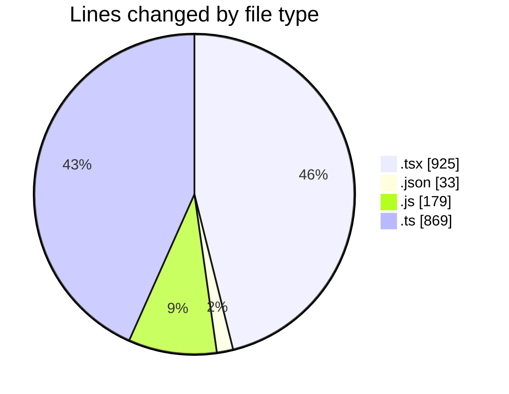
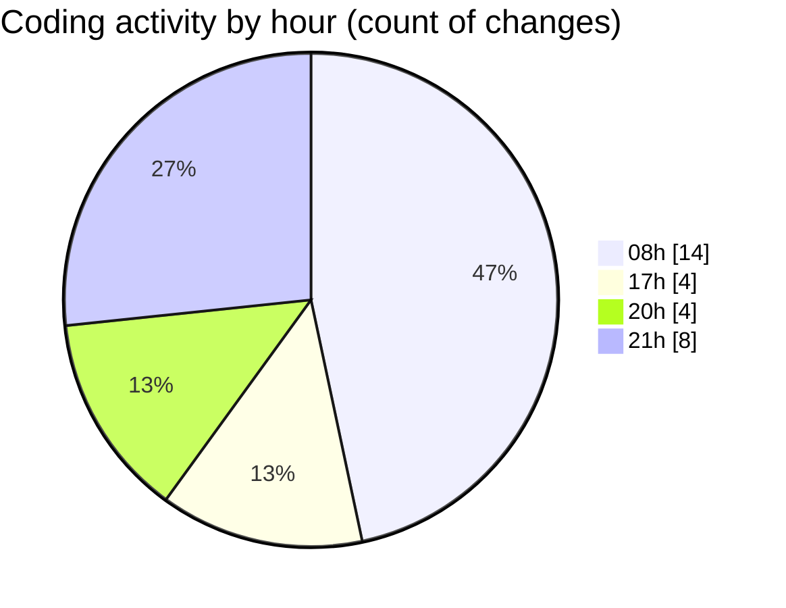

# mbc-web - Activity Summary 

## Overall Statistics

| Stat                   | Value                                                             |
| ---------------------- | ----------------------------------------------------------------- |
| **Lines Added** (➕)   | 1607                                          |
| **Lines Removed** (➖) | 399                                        |
| **Net Change** (↕)    | 1208                |
| **Active Time** (⌚)   | 37 minutes |

## Modified Files
- **RenderInputField.tsx** (+376, -81)
- **page.tsx** (+10, -0)
- **components.json** (+33, -0)
- **tailwind.config.js** (+170, -9)
- **use-create-editor.ts** (+563, -306)
- **toolbar.tsx** (+249, -0)
- **fixed-toolbar-plugin.tsx** (+15, -0)
- **fixed-toolbar-button.tsx** (+191, -3)

## Visualizations

### By File Type (Lines Changed)

### By Hour (Estimated Activity Count)

> **Last Updated:** 28/01/2025, 21:15:49