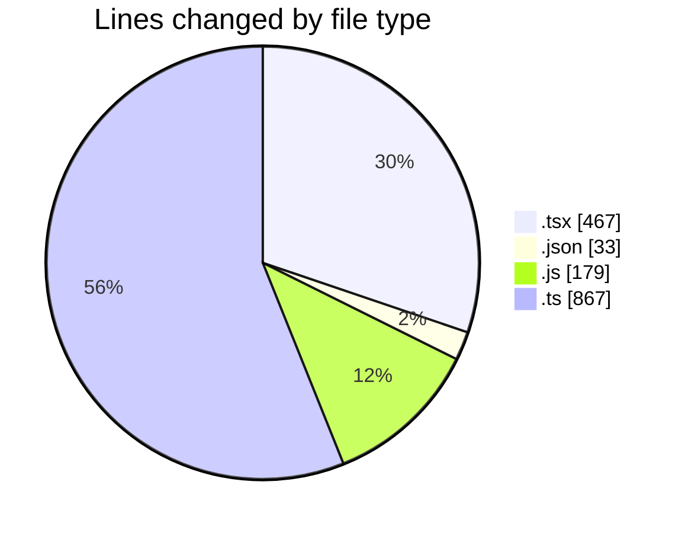
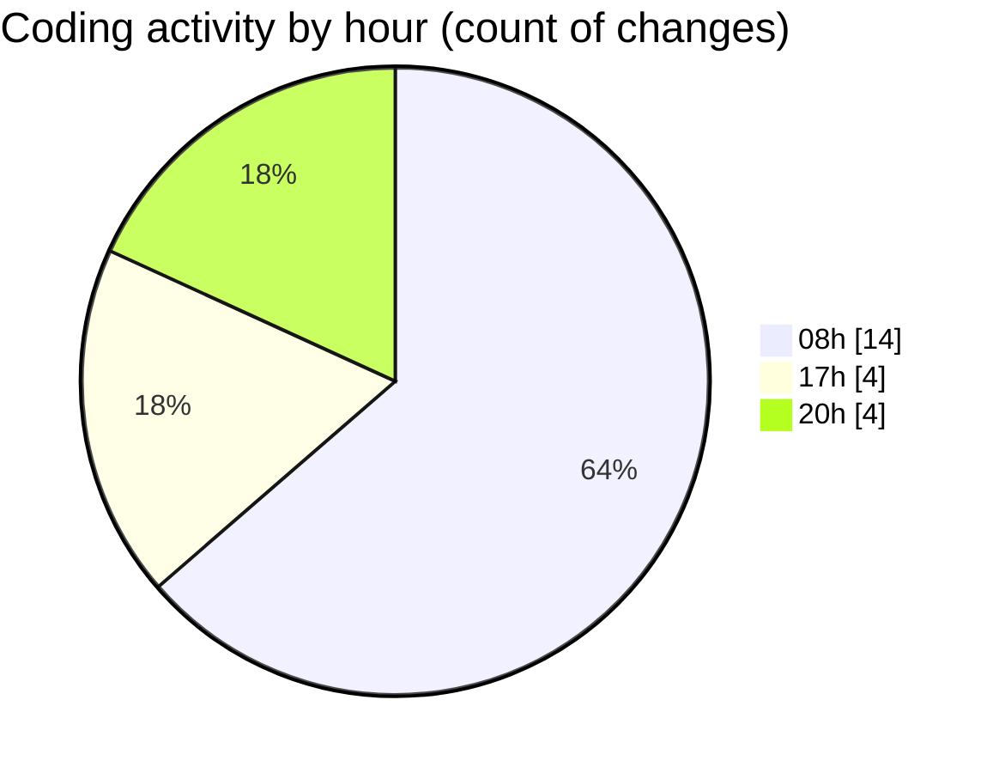

# mbc-web - Activity Summary 

## Overall Statistics

| Stat                   | Value                                                             |
| ---------------------- | ----------------------------------------------------------------- |
| **Lines Added** (➕)   | 1150                                          |
| **Lines Removed** (➖) | 396                                        |
| **Net Change** (↕)    | 754                |
| **Active Time** (⌚)   | 31 minutes |

## Modified Files
- **RenderInputField.tsx** (+376, -81)
- **page.tsx** (+10, -0)
- **components.json** (+33, -0)
- **tailwind.config.js** (+170, -9)
- **use-create-editor.ts** (+561, -306)

## Visualizations

### By File Type (Lines Changed)

### By Hour (Estimated Activity Count)

> **Last Updated:** 28/01/2025, 20:55:49