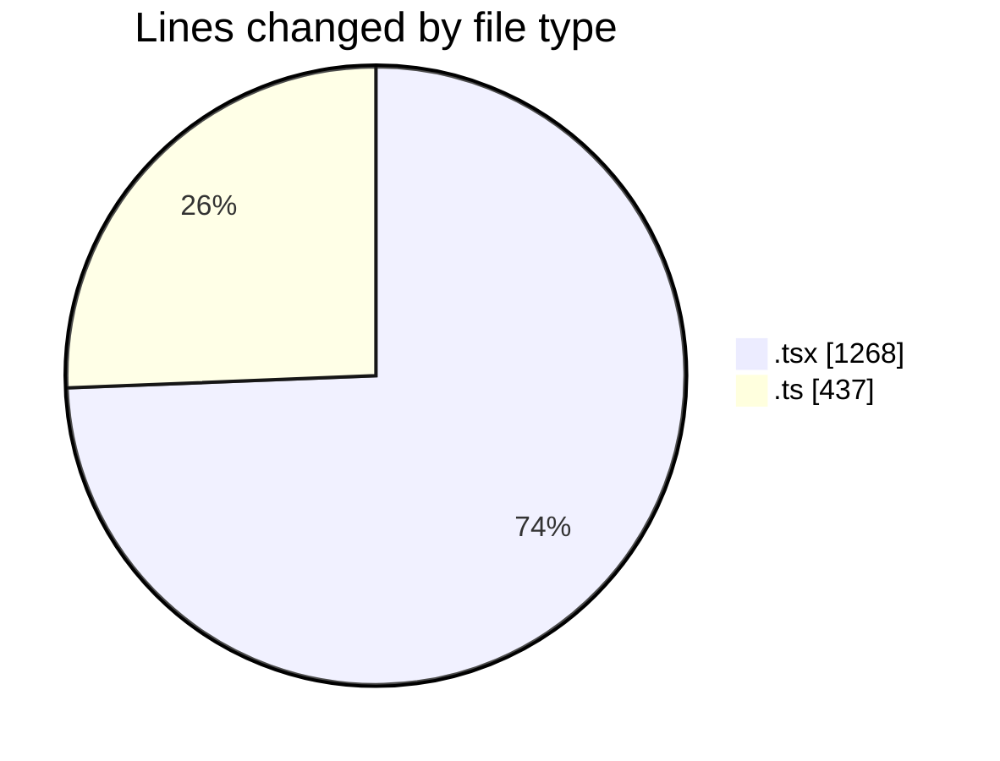
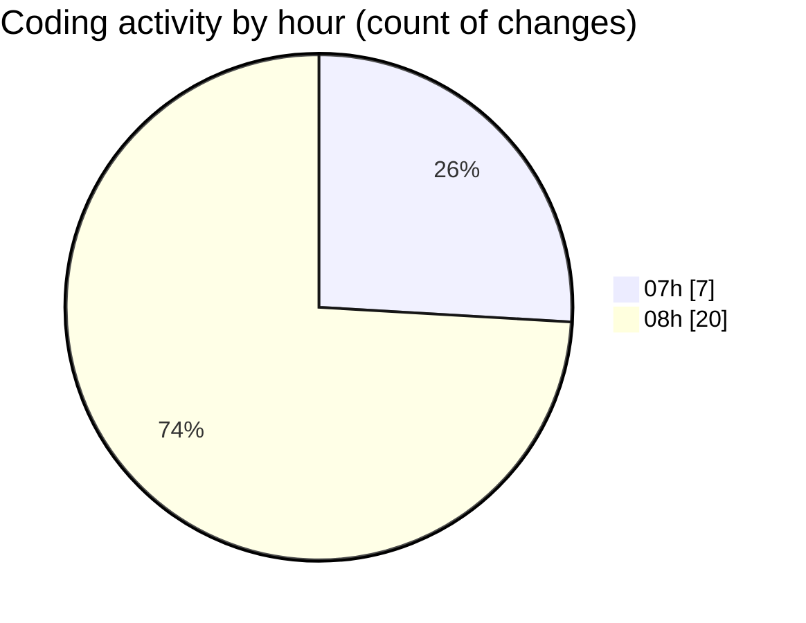

# mbc-web - Activity Summary 

## Overall Statistics

| Stat                   | Value                                                             |
| ---------------------- | ----------------------------------------------------------------- |
| **Lines Added** (➕)   | 1698                                          |
| **Lines Removed** (➖) | 7                                        |
| **Net Change** (↕)    | 1691                |
| **Active Time** (⌚)   | 31 minutes |

## Modified Files
- **fixed-toolbar-button.tsx** (+1, -2)
- **use-create-editor.ts** (+1, -0)
- **mark-toolbar-button.tsx** (+20, -0)
- **fixed-toolbar-buttons.tsx** (+187, -0)
- **-config.tsx** (+700, -0)
- **RenderInputField.tsx** (+2, -0)
- **color-dropdown-menu.tsx** (+57, -0)
- **color-picker.tsx** (+80, -2)
- **color-dropdown-menu-items.tsx** (+111, -2)
- **colors-custom.tsx** (+72, -0)
- **color-input.tsx** (+31, -1)
- **color-constants.ts** (+436, -0)

## Visualizations

### By File Type (Lines Changed)

### By Hour (Estimated Activity Count)

> **Last Updated:** 29/01/2025, 08:31:34