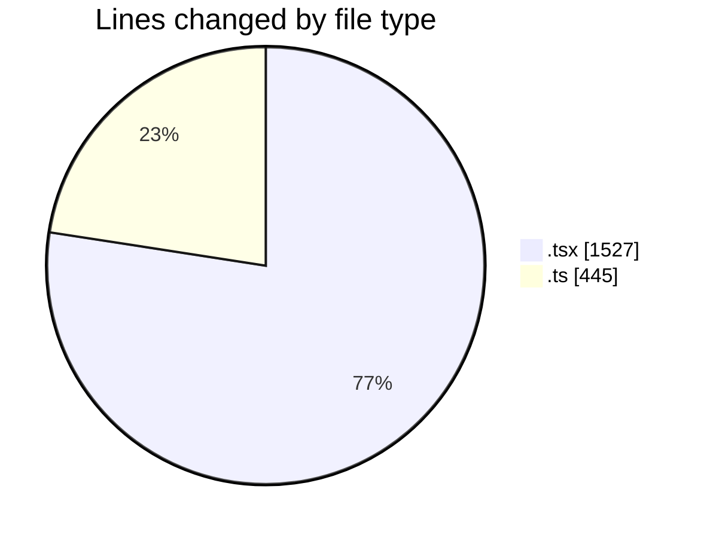
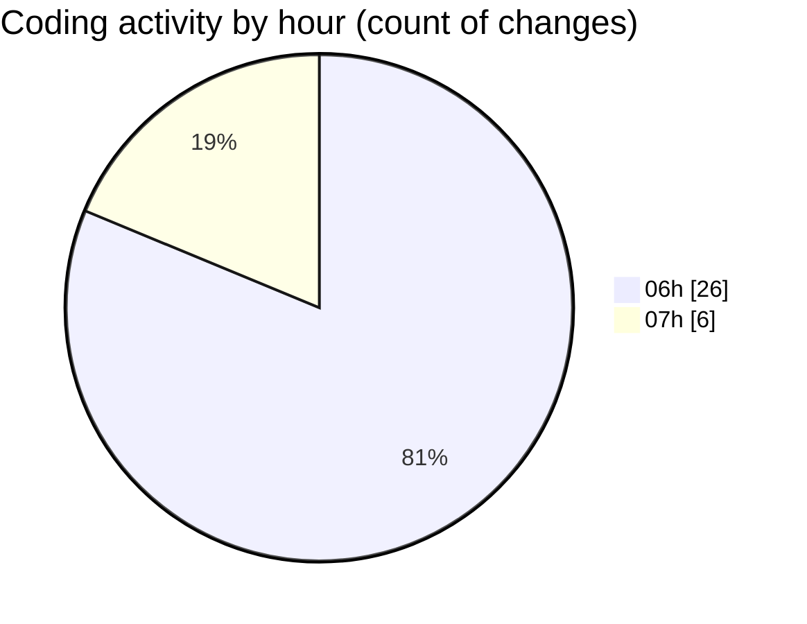

# mbc-web - Activity Summary 

## Overall Statistics

| Stat                   | Value                                                             |
| ---------------------- | ----------------------------------------------------------------- |
| **Lines Added** (➕)   | 1855                                          |
| **Lines Removed** (➖) | 117                                        |
| **Net Change** (↕)    | 1738                |
| **Active Time** (⌚)   | 49 minutes |

## Modified Files
- **fixed-toolbar-buttons.tsx** (+187, -0)
- **indent-todo-toolbar-button.tsx** (+23, -2)
- **toggle-toolbar-button.tsx** (+22, -0)
- **link-toolbar-button.tsx** (+29, -3)
- **use-create-editor.ts** (+258, -1)
- **todo-list-element.tsx** (+46, -3)
- **checkbox.tsx** (+27, -4)
- **-config.tsx** (+769, -104)
- **RenderInputField.tsx** (+307, -0)
- **types.ts** (+186, -0)
- **TabsField.tsx** (+1, -0)

## Visualizations

### By File Type (Lines Changed)

### By Hour (Estimated Activity Count)

> **Last Updated:** 30/01/2025, 07:11:49