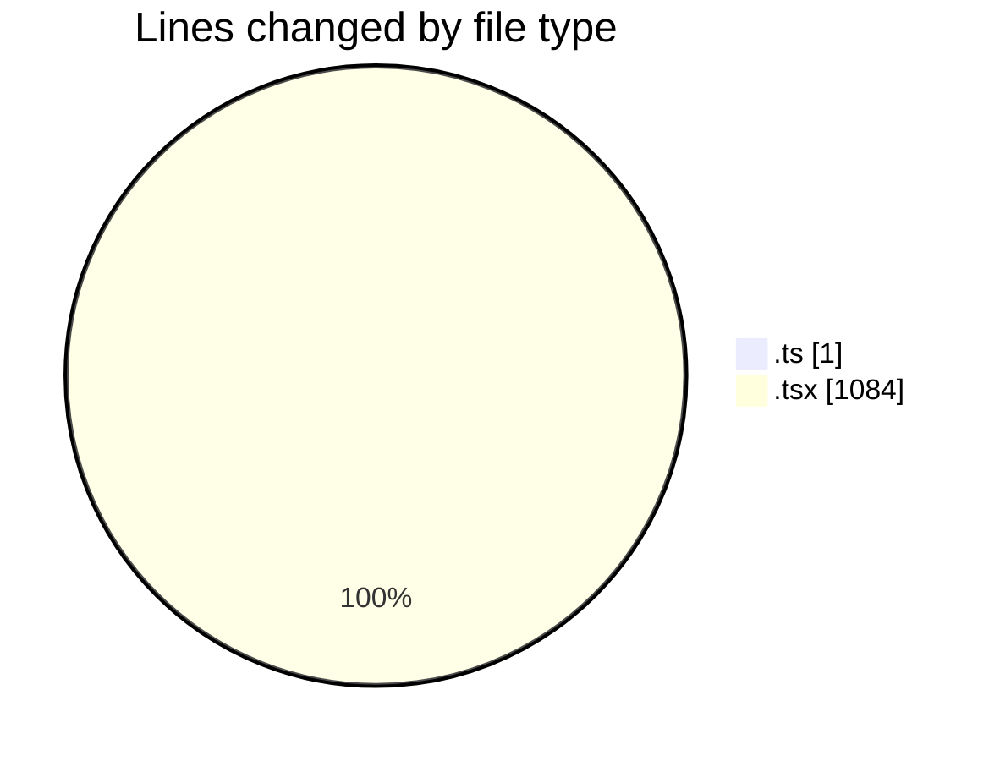
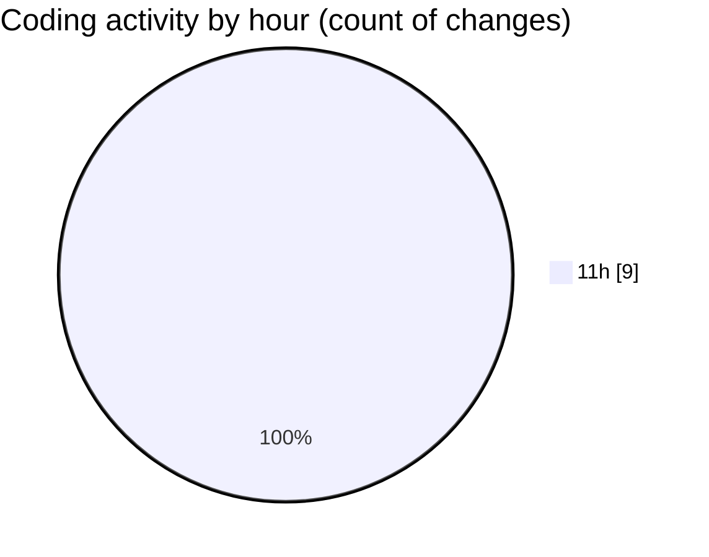

# audiobooks-web - Activity Summary 

## Overall Statistics

| Stat                   | Value                                                             |
| ---------------------- | ----------------------------------------------------------------- |
| **Lines Added** (➕)   | 1083                                          |
| **Lines Removed** (➖) | 2                                        |
| **Net Change** (↕)    | 1081                |
| **Active Time** (⌚)   | 14 minutes |

## Modified Files
- **types.d.ts** (+1, -0)
- **PlayerContext.tsx** (+214, -0)
- **AudioList.tsx** (+237, -0)
- **$livro.tsx** (+181, -2)
- **index.tsx** (+133, -0)
- **$jornada.tsx** (+176, -0)
- **ContentCard.tsx** (+141, -0)

## Visualizations

### By File Type (Lines Changed)

### By Hour (Estimated Activity Count)

> **Last Updated:** 31/01/2025, 11:35:18