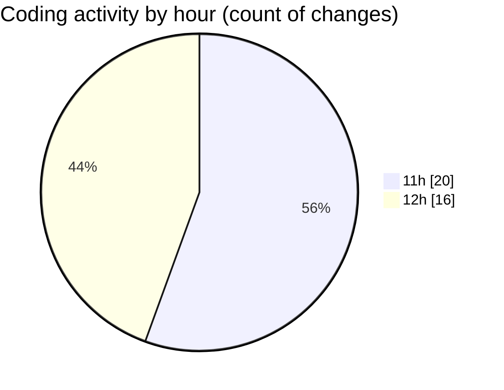

# audiobooks-web - Activity Summary 

## Overall Statistics

| Stat                   | Value                                                             |
| ---------------------- | ----------------------------------------------------------------- |
| **Lines Added** (➕)   | 1775                                          |
| **Lines Removed** (➖) | 29                                        |
| **Net Change** (↕)    | 1746                |
| **Active Time** (⌚)   | 52 minutes |

## Modified Files
- **types.d.ts** (+1, -0)
- **PlayerContext.tsx** (+214, -0)
- **AudioList.tsx** (+237, -0)
- **$livro.tsx** (+181, -2)
- **index.tsx** (+133, -0)
- **$jornada.tsx** (+176, -0)
- **ContentCard.tsx** (+145, -2)
- **index.css** (+132, -5)
- **index.tsx** (+449, -0)
- **slider-volume.module.css** (+32, -0)
- **slider-duration.module.css** (+40, -20)
- **VolumeSlider.tsx** (+35, -0)

## Visualizations

### By File Type (Lines Changed)

### By Hour (Estimated Activity Count)

> **Last Updated:** 31/01/2025, 12:40:18