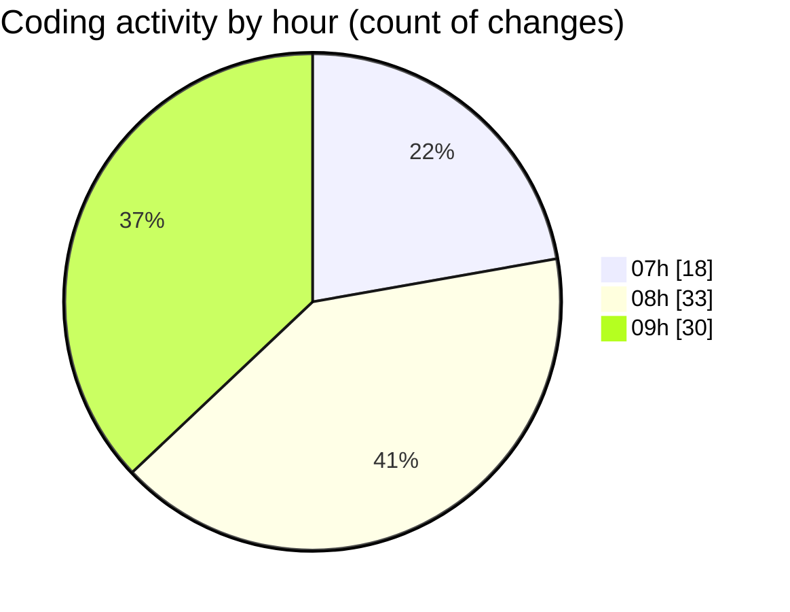

# mbc-web - Activity Summary 

## Overall Statistics

| Stat                   | Value                                                             |
| ---------------------- | ----------------------------------------------------------------- |
| **Lines Added** (➕)   | 2216                                          |
| **Lines Removed** (➖) | 205                                        |
| **Net Change** (↕)    | 2011                |
| **Active Time** (⌚)   | 112 minutes |

## Modified Files
- **TabsField.tsx** (+283, -18)
- **-config.tsx** (+763, -99)
- **Checkbox.tsx** (+28, -0)
- **types.ts** (+187, -0)
- **RenderInputField.tsx** (+351, -15)
- **MultiCheckbox.tsx** (+61, -20)
- **tailwind.config.js** (+170, -8)
- **Toggle.tsx** (+25, -0)
- **switch.tsx** (+28, -0)
- **Tabs.module.css** (+25, -0)
- **Trigger.tsx** (+31, -0)
- **List.tsx** (+30, -0)
- **ImageField.tsx** (+234, -45)

## Visualizations

### By File Type (Lines Changed)

### By Hour (Estimated Activity Count)

> **Last Updated:** 03/02/2025, 09:40:31