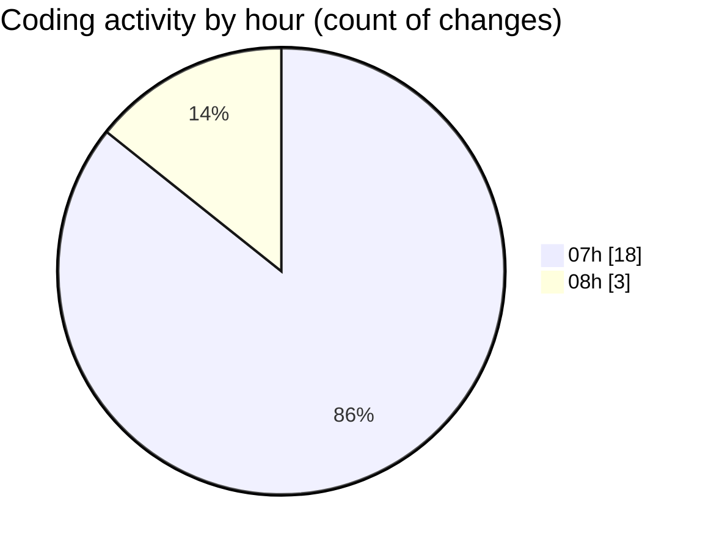

# mbc-web - Activity Summary 

## Overall Statistics

| Stat                   | Value                                                             |
| ---------------------- | ----------------------------------------------------------------- |
| **Lines Added** (➕)   | 1583                                          |
| **Lines Removed** (➖) | 20                                        |
| **Net Change** (↕)    | 1563                |
| **Active Time** (⌚)   | 26 minutes |

## Modified Files
- **TabsField.tsx** (+248, -5)
- **-config.tsx** (+730, -0)
- **Checkbox.tsx** (+23, -0)
- **types.ts** (+187, -0)
- **RenderInputField.tsx** (+337, -15)
- **MultiCheckbox.tsx** (+58, -0)

## Visualizations

### By File Type (Lines Changed)

### By Hour (Estimated Activity Count)

> **Last Updated:** 03/02/2025, 08:00:31