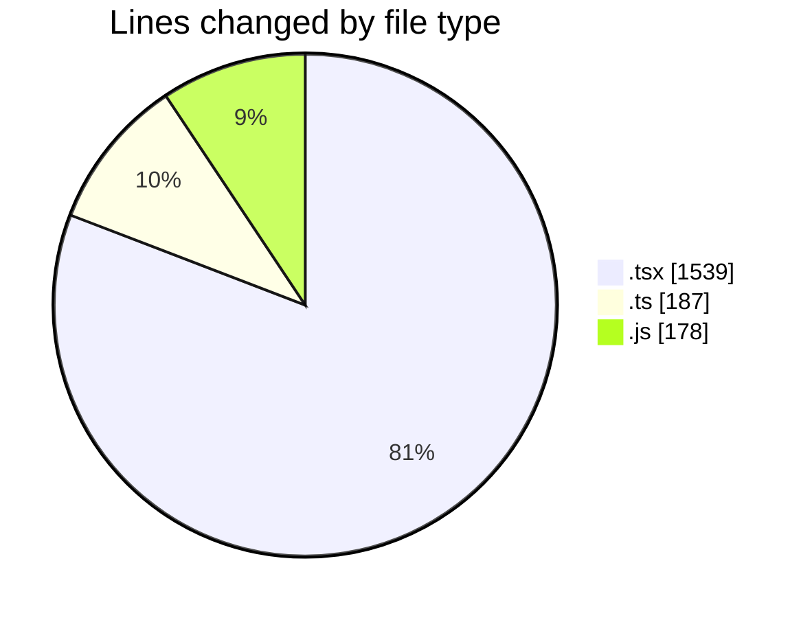
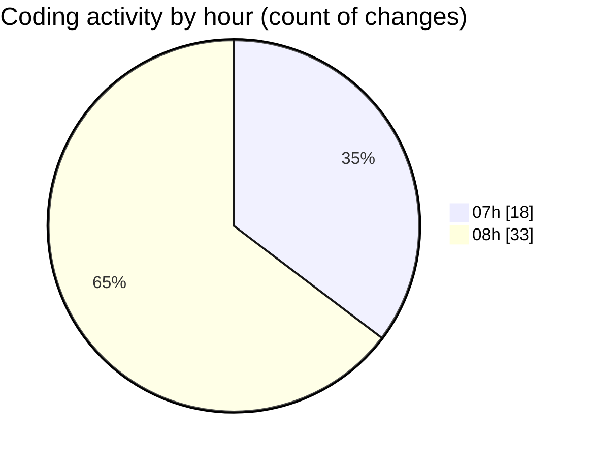

# mbc-web - Activity Summary 

## Overall Statistics

| Stat                   | Value                                                             |
| ---------------------- | ----------------------------------------------------------------- |
| **Lines Added** (➕)   | 1846                                          |
| **Lines Removed** (➖) | 58                                        |
| **Net Change** (↕)    | 1788                |
| **Active Time** (⌚)   | 68 minutes |

## Modified Files
- **TabsField.tsx** (+274, -15)
- **-config.tsx** (+752, -0)
- **Checkbox.tsx** (+28, -0)
- **types.ts** (+187, -0)
- **RenderInputField.tsx** (+351, -15)
- **MultiCheckbox.tsx** (+61, -20)
- **tailwind.config.js** (+170, -8)
- **Toggle.tsx** (+23, -0)

## Visualizations

### By File Type (Lines Changed)

### By Hour (Estimated Activity Count)

> **Last Updated:** 03/02/2025, 09:00:31