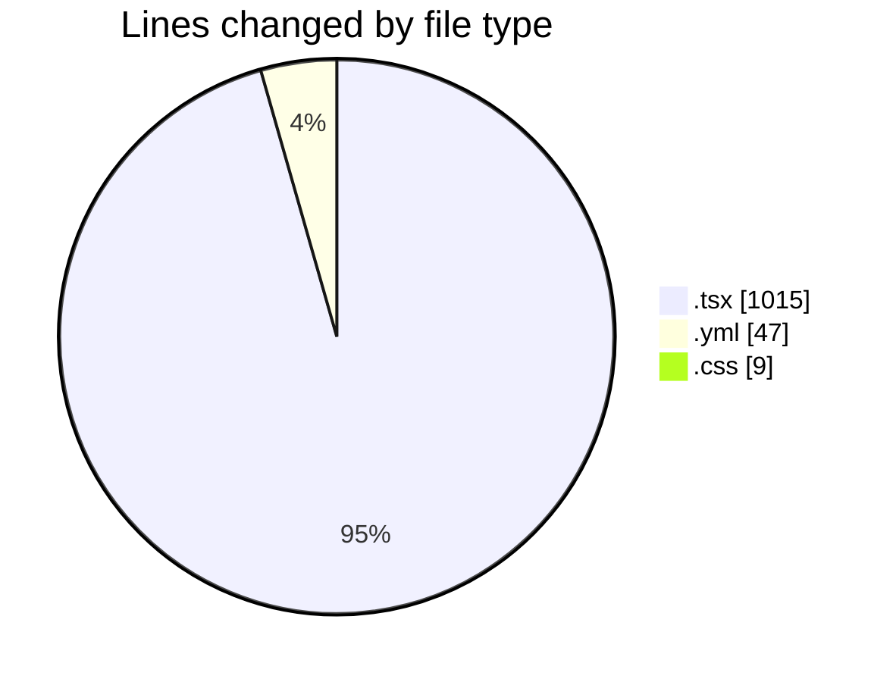
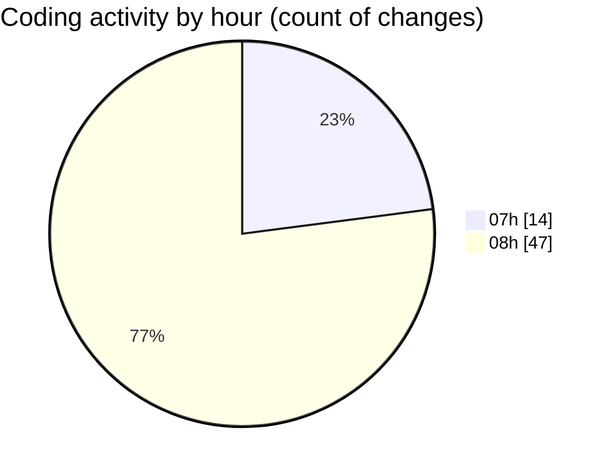

# mbc-web - Activity Summary 

## Overall Statistics

| Stat                   | Value                                                             |
| ---------------------- | ----------------------------------------------------------------- |
| **Lines Added** (➕)   | 971                                          |
| **Lines Removed** (➖) | 100                                        |
| **Net Change** (↕)    | 871                |
| **Active Time** (⌚)   | 83 minutes |

## Modified Files
- **ImageField.tsx** (+14, -78)
- **AppSidebar.tsx** (+102, -12)
- **homolog.yml** (+47, -0)
- **index.tsx** (+60, -0)
- **-config.tsx** (+214, -8)
- **CrudRecordForm.tsx** (+456, -0)
- **RenderInputField.tsx** (+11, -1)
- **Select.tsx** (+58, -1)
- **Select.module.css** (+9, -0)

## Visualizations

### By File Type (Lines Changed)

### By Hour (Estimated Activity Count)

> **Last Updated:** 05/02/2025, 08:24:41