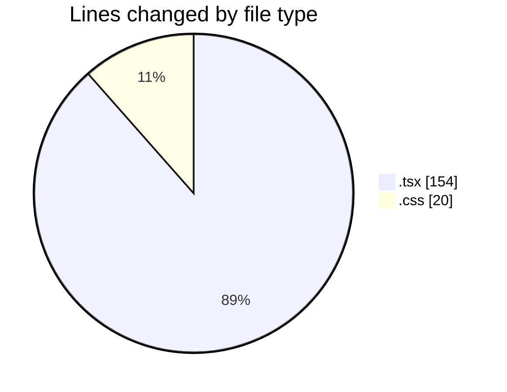
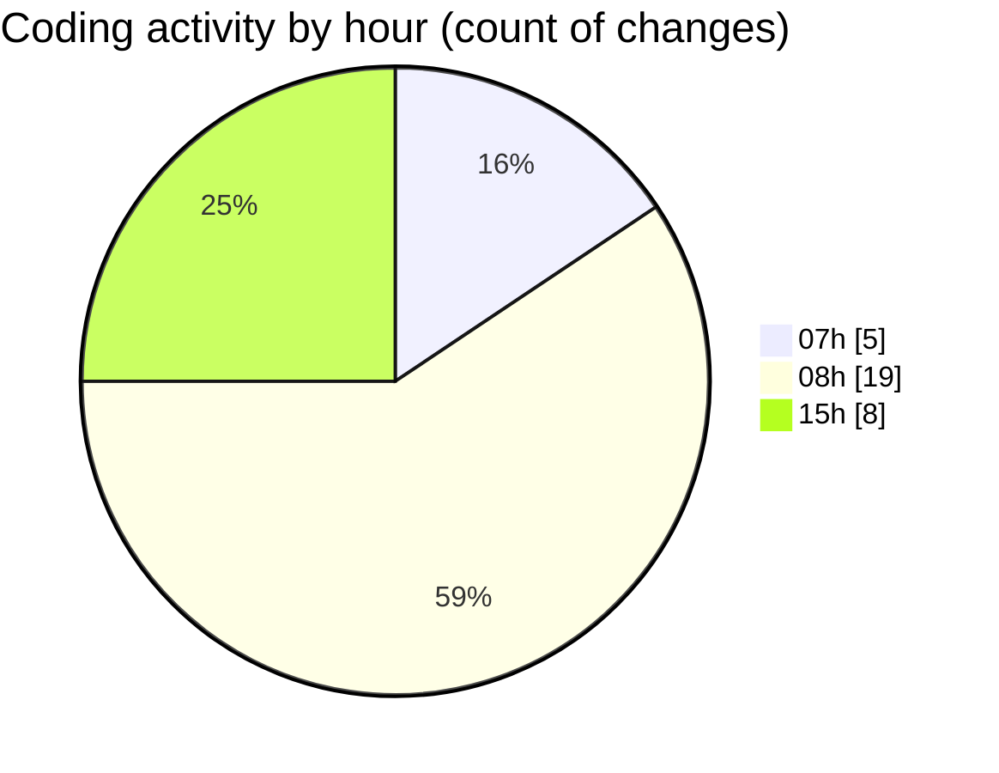

# mbc-web - Activity Summary 

## Overall Statistics

| Stat                   | Value                                                             |
| ---------------------- | ----------------------------------------------------------------- |
| **Lines Added** (➕)   | 153                                          |
| **Lines Removed** (➖) | 21                                        |
| **Net Change** (↕)    | 132                |
| **Active Time** (⌚)   | 44 minutes |

## Modified Files
- **MultiSelect.tsx** (+9, -0)
- **RenderInputField.tsx** (+7, -0)
- **-config.tsx** (+51, -13)
- **CrudRecordForm.tsx** (+12, -8)
- **Textarea.tsx** (+54, -0)
- **Textarea.module.css** (+20, -0)

## Visualizations

### By File Type (Lines Changed)

### By Hour (Estimated Activity Count)

> **Last Updated:** 07/02/2025, 15:13:38