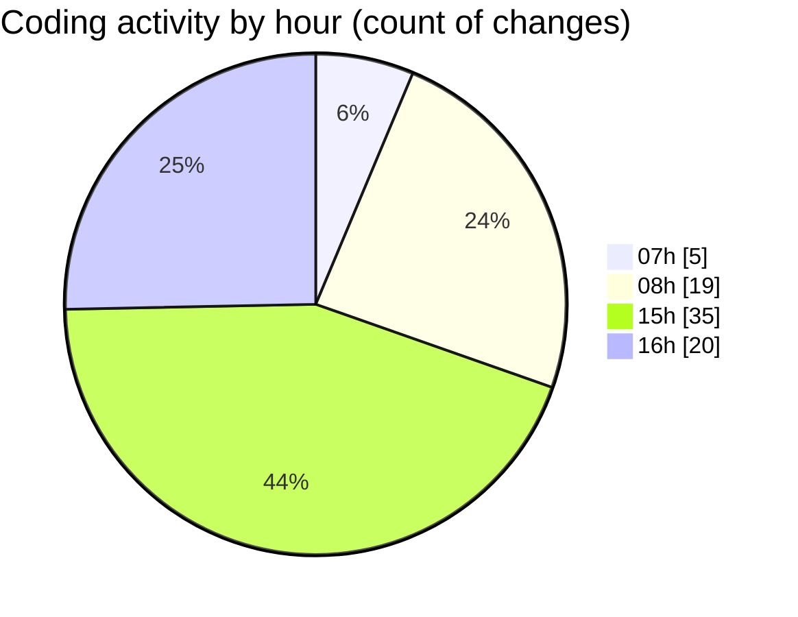

# mbc-web - Activity Summary 

## Overall Statistics

| Stat                   | Value                                                             |
| ---------------------- | ----------------------------------------------------------------- |
| **Lines Added** (➕)   | 1928                                          |
| **Lines Removed** (➖) | 64                                        |
| **Net Change** (↕)    | 1864                |
| **Active Time** (⌚)   | 115 minutes |

## Modified Files
- **MultiSelect.tsx** (+9, -0)
- **RenderInputField.tsx** (+388, -1)
- **-config.tsx** (+738, -53)
- **CrudRecordForm.tsx** (+18, -8)
- **Textarea.tsx** (+54, -0)
- **Textarea.module.css** (+20, -0)
- **ActionMenu.tsx** (+75, -1)
- **index.tsx** (+458, -0)
- **Tabs.module.css** (+0, -1)
- **settings.json** (+24, -0)
- **index.tsx** (+82, -0)
- **button.tsx** (+62, -0)

## Visualizations

### By File Type (Lines Changed)

### By Hour (Estimated Activity Count)

> **Last Updated:** 07/02/2025, 16:58:08