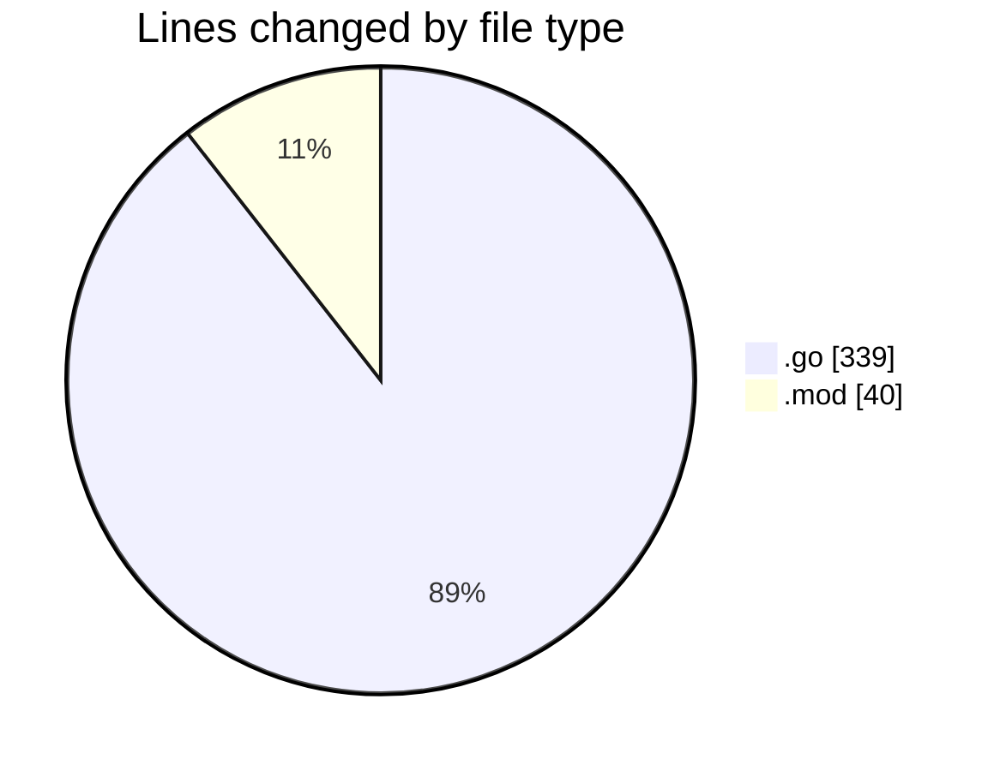
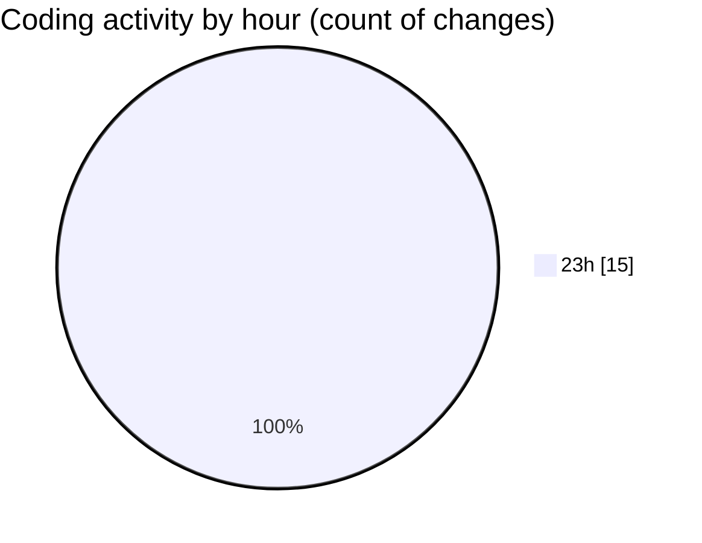

# test-rountines - Activity Summary 

## Overall Statistics

| Stat                   | Value                                                             |
| ---------------------- | ----------------------------------------------------------------- |
| **Lines Added** (➕)   | 371                                          |
| **Lines Removed** (➖) | 8                                        |
| **Net Change** (↕)    | 363                |
| **Active Time** (⌚)   | 17 minutes |

## Modified Files
- **main.go** (+172, -8)
- **go.mod** (+40, -0)
- **main_test.go** (+79, -0)
- **stress_test.go** (+80, -0)

## Visualizations

### By File Type (Lines Changed)

### By Hour (Estimated Activity Count)

> **Last Updated:** 07/02/2025, 23:58:42