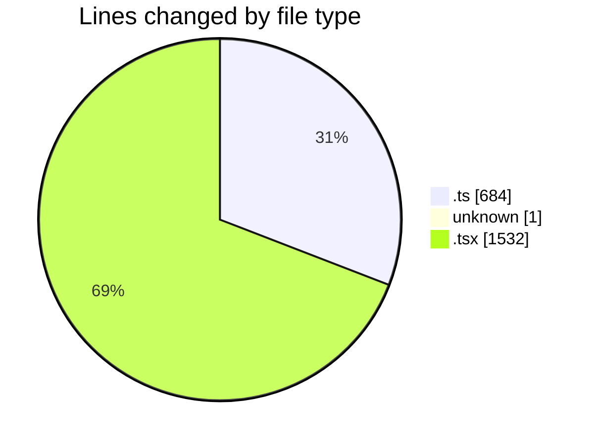
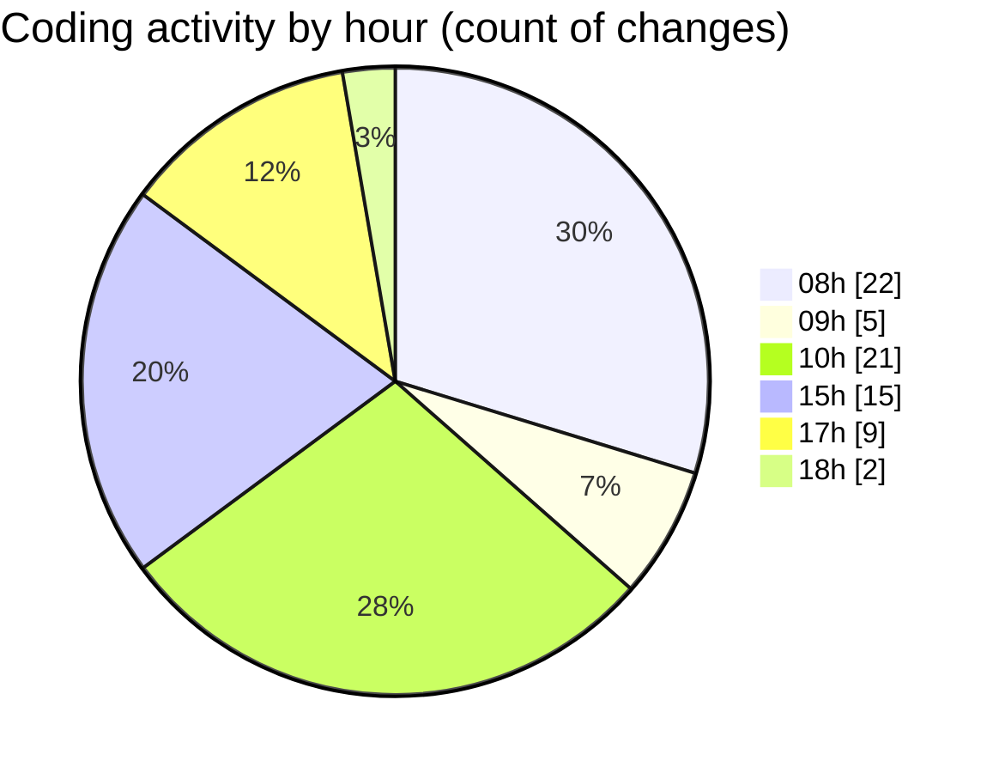

# mbc-web - Activity Summary 

## Overall Statistics

| Stat                   | Value                                                             |
| ---------------------- | ----------------------------------------------------------------- |
| **Lines Added** (➕)   | 2105                                          |
| **Lines Removed** (➖) | 112                                        |
| **Net Change** (↕)    | 1993                |
| **Active Time** (⌚)   | 96 minutes |

## Modified Files
- **AbstractApiClient.ts** (+168, -23)
- **ht** (+1, -0)
- **httpClient.ts** (+53, -13)
- **utils.ts** (+3, -0)
- **UsuariosAPI.ts** (+123, -12)
- **index.tsx** (+114, -0)
- **-config.tsx** (+613, -1)
- **RenderInputField.tsx** (+380, -0)
- **useUsuarios.ts** (+89, -59)
- **MultiSelect.tsx** (+376, -0)
- **Checkbox.tsx** (+30, -0)
- **index.tsx** (+14, -4)
- **ServerAPI.ts** (+141, -0)

## Visualizations

### By File Type (Lines Changed)

### By Hour (Estimated Activity Count)

> **Last Updated:** 17/02/2025, 18:19:12