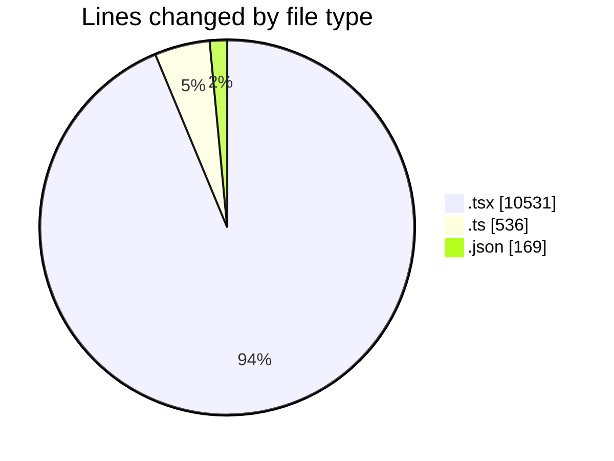
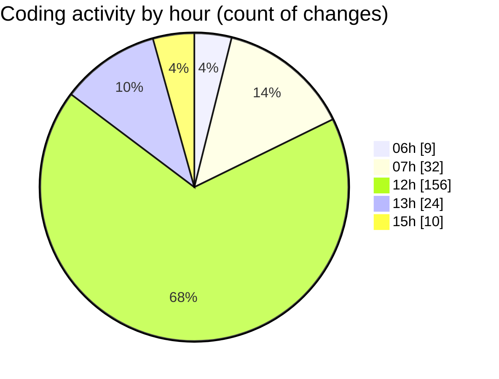

# mbc-web - Activity Summary 

## Overall Statistics

| Stat                   | Value                                                             |
| ---------------------- | ----------------------------------------------------------------- |
| **Lines Added** (➕)   | 10851                                          |
| **Lines Removed** (➖) | 385                                        |
| **Net Change** (↕)    | 10466                |
| **Active Time** (⌚)   | 257 minutes |

## Modified Files
- **index.tsx** (+28, -104)
- **-config.ts** (+180, -0)
- **-config.tsx** (+867, -0)
- **-config.tsx** (+191, -0)
- **UsuariosAPI.ts** (+0, -1)
- **CrudRecordForm.tsx** (+468, -1)
- **useDeleteCrudMutation.ts** (+43, -12)
- **RequestApiError.ts** (+32, -0)
- **utils.ts** (+2, -0)
- **CrudDeleteModal.tsx** (+153, -8)
- **package.json** (+144, -0)
- **index.tsx** (+70, -20)
- **LeadsAPI.ts** (+120, -64)
- **useLeads.ts** (+17, -0)
- **-config.tsx** (+196, -0)
- **login.tsx** (+0, -3)
- **__root.tsx** (+31, -1)
- **useAuthentication.ts** (+0, -3)
- **-config.tsx** (+0, -6)
- **tooltip.tsx** (+94, -1)
- **inline-combobox.tsx** (+395, -1)
- **index.d.ts** (+27, -0)
- **hr-element.tsx** (+35, -4)
- **plate-editor.tsx** (+19, -2)
- **ai-leaf.tsx** (+25, -3)
- **avatar.tsx** (+20, -1)
- **block-selection.tsx** (+49, -2)
- **blockquote-element.tsx** (+23, -3)
- **calendar.tsx** (+69, -1)
- **caption.tsx** (+49, -1)
- **code-block-combobox.tsx** (+203, -1)
- **code-block-element.tsx** (+41, -3)
- **code-leaf.tsx** (+25, -3)
- **code-line-element.tsx** (+12, -3)
- **code-syntax-leaf.tsx** (+22, -3)
- **column-element.tsx** (+134, -2)
- **column-group-element.tsx** (+197, -1)
- **command.tsx** (+104, -3)
- **comment-create-form.tsx** (+38, -3)
- **comment-avatar.tsx** (+23, -3)
- **comment-item.tsx** (+75, -3)
- **comment-leaf.tsx** (+50, -3)
- **comment-more-dropdown.tsx** (+45, -3)
- **comment-reply-items.tsx** (+23, -3)
- **comment-resolve-button.tsx** (+32, -3)
- **comment-value.tsx** (+35, -3)
- **comments-popover.tsx** (+64, -3)
- **date-element.tsx** (+90, -1)
- **dialog.tsx** (+63, -3)
- **dropdown-menu.tsx** (+241, -0)
- **editor.tsx** (+119, -2)
- **emoji-input-element.tsx** (+81, -1)
- **excalidraw-element.tsx** (+32, -3)
- **fixed-toolbar.tsx** (+11, -1)
- **heading-element.tsx** (+41, -3)
- **highlight-leaf.tsx** (+20, -3)
- **image-element.tsx** (+88, -3)
- **kbd-leaf.tsx** (+23, -3)
- **link-element.tsx** (+33, -3)
- **link-floating-toolbar.tsx** (+163, -3)
- **media-embed-element.tsx** (+136, -3)
- **media-popover.tsx** (+98, -0)
- **mention-input-element.tsx** (+143, -1)
- **paragraph-element.tsx** (+23, -3)
- **placeholder.tsx** (+55, -0)
- **plate-element.tsx** (+25, -1)
- **resizable.tsx** (+78, -3)
- **toolbar.tsx** (+249, -0)
- **popover.tsx** (+43, -3)
- **table-cell-element.tsx** (+167, -0)
- **toggle-element.tsx** (+41, -1)
- **table-row-element.tsx** (+106, -1)
- **table-icons.tsx** (+1055, -1)
- **table-element.tsx** (+324, -3)
- **separator.tsx** (+26, -1)
- **mention-element.tsx** (+64, -0)
- **blockquote-element-static.tsx** (+23, -1)
- **code-block-element-static.tsx** (+28, -1)
- **code-leaf-static.tsx** (+26, -1)
- **code-syntax-leaf-static.tsx** (+21, -0)
- **code-line-element-static.tsx** (+13, -1)
- **color-picker.tsx** (+78, -0)
- **toggle-element-static.tsx** (+28, -1)
- **table-row-element-static.tsx** (+19, -1)
- **paragraph-element-static.tsx** (+19, -0)
- **image-element-static.tsx** (+57, -1)
- **hr-element-static.tsx** (+28, -1)
- **kbd-leaf-static.tsx** (+26, -1)
- **link-element-static.tsx** (+26, -1)
- **highlight-leaf-static.tsx** (+23, -1)
- **comment-leaf-static.tsx** (+26, -1)
- **date-element-static.tsx** (+54, -1)
- **editor-static.tsx** (+56, -1)
- **column-group-element-static.tsx** (+19, -0)
- **column-element-static.tsx** (+32, -0)
- **AuthenticationAPI.ts** (+0, -2)
- **ActionMenu.tsx** (+37, -0)
- **MultiCheckbox.tsx** (+41, -2)
- **ImageField.tsx** (+244, -1)
- **index.tsx** (+458, -0)
- **index.lazy.tsx** (+65, -4)
- **index.tsx** (+0, -3)
- **index.tsx** (+104, -3)
- **index.lazy.tsx** (+71, -5)
- **index.tsx** (+111, -3)
- **index.lazy.tsx** (+124, -1)
- **index.lazy.tsx** (+101, -1)
- **index.lazy.tsx** (+121, -2)
- **login.lazy.tsx** (+95, -0)
- **index.lazy.tsx** (+10, -0)
- **settings.json** (+25, -0)
- **login.lazy.tsx** (+46, -0)
- **cadastro.lazy.tsx** (+53, -0)
- **vite.config.ts** (+32, -1)
- **-config.tsx** (+342, -0)
- **index.lazy.tsx** (+61, -5)

## Visualizations

### By File Type (Lines Changed)

### By Hour (Estimated Activity Count)

> **Last Updated:** 18/02/2025, 15:41:59