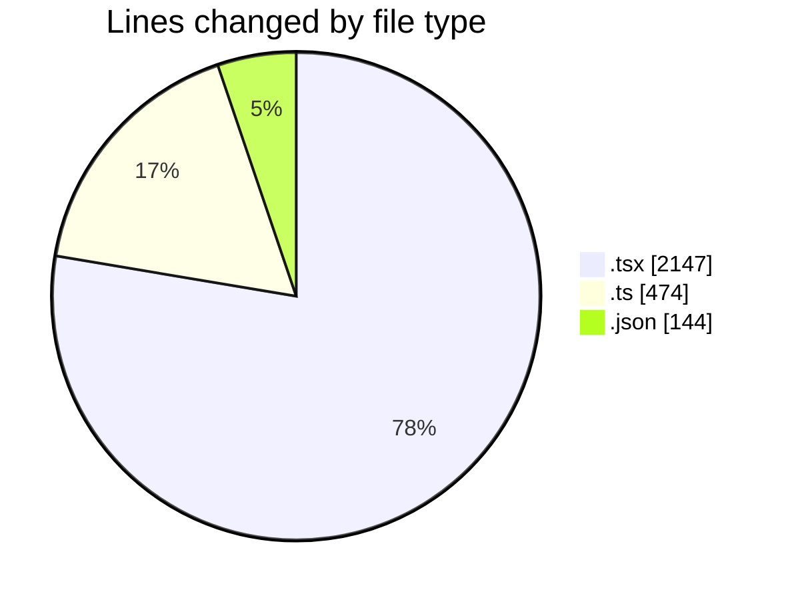
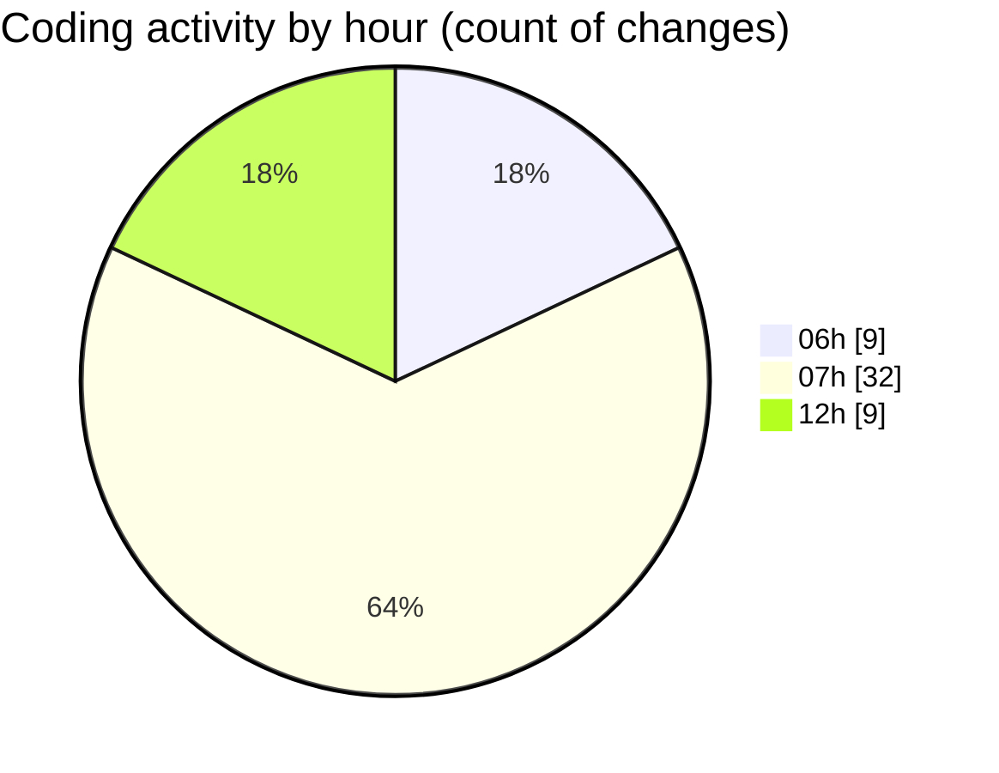

# mbc-web - Activity Summary 

## Overall Statistics

| Stat                   | Value                                                             |
| ---------------------- | ----------------------------------------------------------------- |
| **Lines Added** (➕)   | 2542                                          |
| **Lines Removed** (➖) | 223                                        |
| **Net Change** (↕)    | 2319                |
| **Active Time** (⌚)   | 65 minutes |

## Modified Files
- **index.tsx** (+28, -104)
- **-config.ts** (+180, -0)
- **-config.tsx** (+867, -0)
- **-config.tsx** (+191, -0)
- **UsuariosAPI.ts** (+0, -1)
- **CrudRecordForm.tsx** (+468, -1)
- **useDeleteCrudMutation.ts** (+43, -12)
- **RequestApiError.ts** (+32, -0)
- **utils.ts** (+2, -0)
- **CrudDeleteModal.tsx** (+153, -8)
- **package.json** (+144, -0)
- **index.tsx** (+70, -20)
- **LeadsAPI.ts** (+120, -64)
- **useLeads.ts** (+17, -0)
- **-config.tsx** (+196, -0)
- **login.tsx** (+0, -3)
- **__root.tsx** (+31, -1)
- **useAuthentication.ts** (+0, -3)
- **-config.tsx** (+0, -6)

## Visualizations

### By File Type (Lines Changed)

### By Hour (Estimated Activity Count)

> **Last Updated:** 18/02/2025, 12:11:59