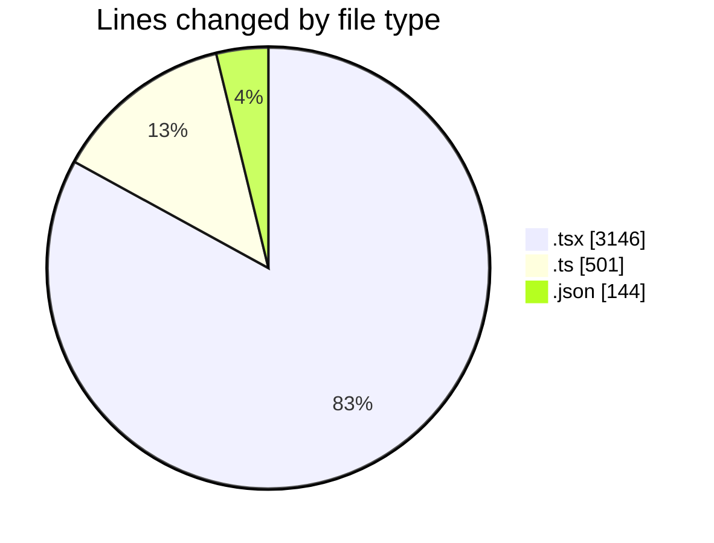
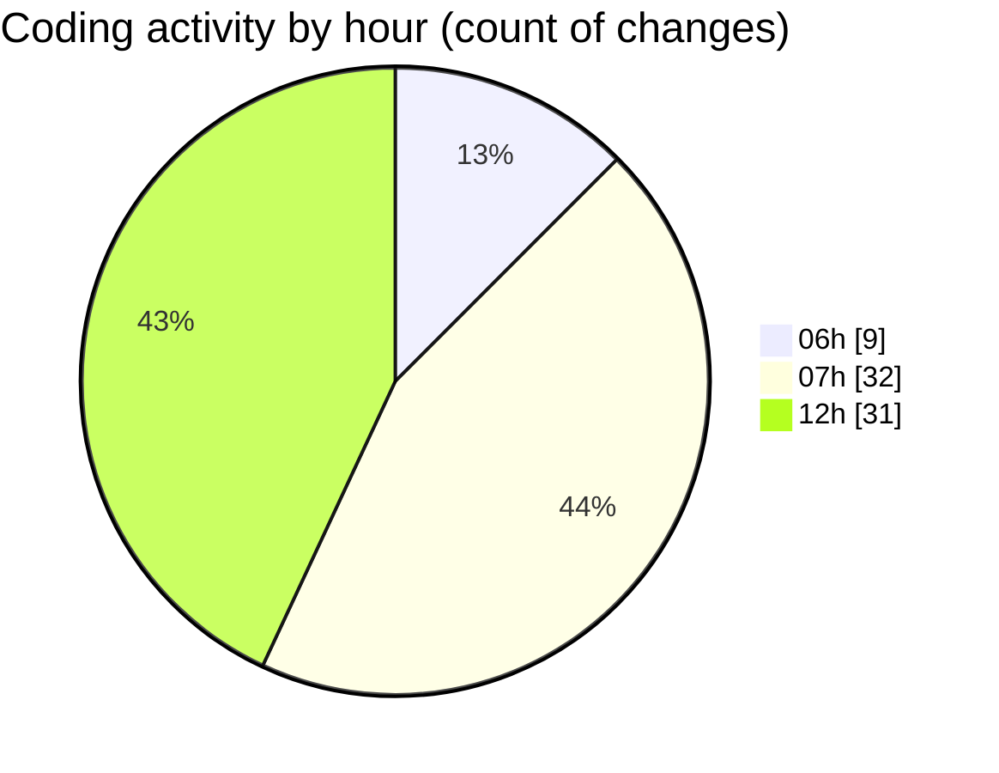

# mbc-web - Activity Summary 

## Overall Statistics

| Stat                   | Value                                                             |
| ---------------------- | ----------------------------------------------------------------- |
| **Lines Added** (➕)   | 3550                                          |
| **Lines Removed** (➖) | 241                                        |
| **Net Change** (↕)    | 3309                |
| **Active Time** (⌚)   | 89 minutes |

## Modified Files
- **index.tsx** (+28, -104)
- **-config.ts** (+180, -0)
- **-config.tsx** (+867, -0)
- **-config.tsx** (+191, -0)
- **UsuariosAPI.ts** (+0, -1)
- **CrudRecordForm.tsx** (+468, -1)
- **useDeleteCrudMutation.ts** (+43, -12)
- **RequestApiError.ts** (+32, -0)
- **utils.ts** (+2, -0)
- **CrudDeleteModal.tsx** (+153, -8)
- **package.json** (+144, -0)
- **index.tsx** (+70, -20)
- **LeadsAPI.ts** (+120, -64)
- **useLeads.ts** (+17, -0)
- **-config.tsx** (+196, -0)
- **login.tsx** (+0, -3)
- **__root.tsx** (+31, -1)
- **useAuthentication.ts** (+0, -3)
- **-config.tsx** (+0, -6)
- **tooltip.tsx** (+94, -0)
- **inline-combobox.tsx** (+395, -0)
- **index.d.ts** (+27, -0)
- **hr-element.tsx** (+35, -4)
- **plate-editor.tsx** (+19, -2)
- **ai-leaf.tsx** (+25, -3)
- **avatar.tsx** (+20, -1)
- **block-selection.tsx** (+49, -2)
- **blockquote-element.tsx** (+23, -3)
- **calendar.tsx** (+69, -1)
- **caption.tsx** (+49, -1)
- **code-block-combobox.tsx** (+203, -1)

## Visualizations

### By File Type (Lines Changed)

### By Hour (Estimated Activity Count)

> **Last Updated:** 18/02/2025, 12:16:59