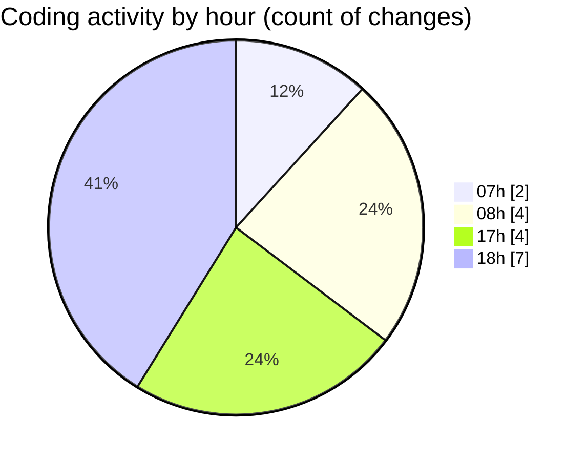

# mbc-web - Activity Summary 

## Overall Statistics

| Stat                   | Value                                                             |
| ---------------------- | ----------------------------------------------------------------- |
| **Lines Added** (➕)   | 341                                          |
| **Lines Removed** (➖) | 26                                        |
| **Net Change** (↕)    | 315                |
| **Active Time** (⌚)   | 27 minutes |

## Modified Files
- **index.lazy.tsx** (+0, -20)
- **CrudRecordForm.tsx** (+1, -0)
- **CrudUtils.tsx** (+320, -0)
- **index.lazy.tsx** (+3, -0)
- **httpClient.ts** (+4, -1)
- **index.lazy.tsx** (+9, -5)
- **ServerAPI.ts** (+4, -0)

## Visualizations

### By File Type (Lines Changed)

### By Hour (Estimated Activity Count)

> **Last Updated:** 19/02/2025, 18:22:23