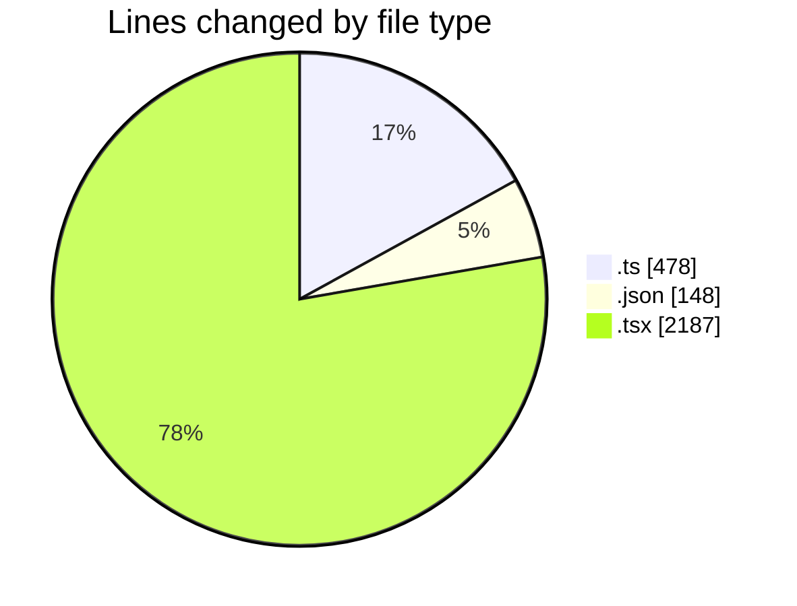
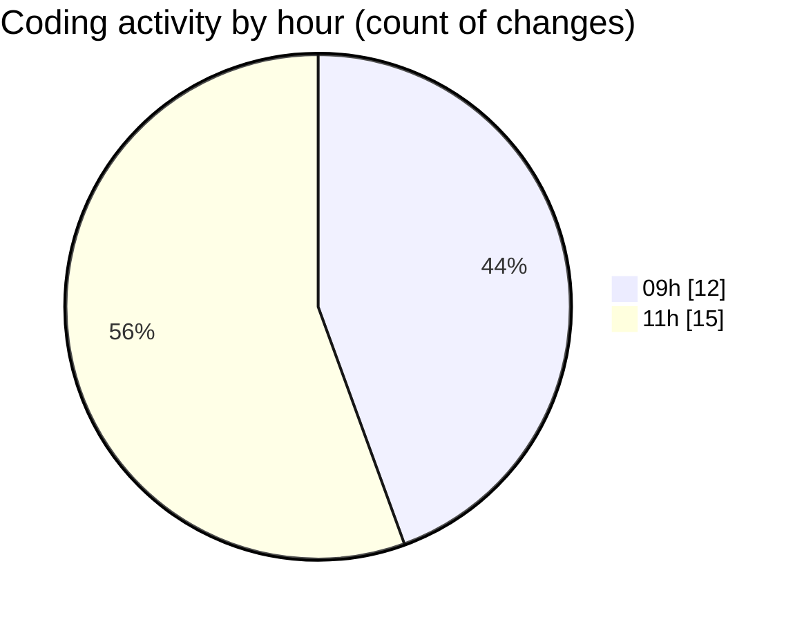

# mbc-web - Activity Summary 

## Overall Statistics

| Stat                   | Value                                                             |
| ---------------------- | ----------------------------------------------------------------- |
| **Lines Added** (➕)   | 2770                                          |
| **Lines Removed** (➖) | 43                                        |
| **Net Change** (↕)    | 2727                |
| **Active Time** (⌚)   | 30 minutes |

## Modified Files
- **httpClient.ts** (+50, -4)
- **axiosConfig.ts** (+65, -36)
- **package.json** (+148, -0)
- **useUsuarios.ts** (+29, -0)
- **index.lazy.tsx** (+52, -0)
- **ServerAPI.ts** (+149, -0)
- **AbstractApiClient.ts** (+145, -0)
- **index.lazy.tsx** (+68, -0)
- **RenderInputField.tsx** (+386, -0)
- **RenderViewField.tsx** (+146, -0)
- **index.lazy.tsx** (+61, -0)
- **-config.tsx** (+191, -3)
- **index.lazy.tsx** (+103, -0)
- **index.tsx** (+460, -0)
- **index.lazy.tsx** (+123, -0)
- **index.lazy.tsx** (+125, -0)
- **CrudRecordForm.tsx** (+469, -0)

## Visualizations

### By File Type (Lines Changed)

### By Hour (Estimated Activity Count)

> **Last Updated:** 20/02/2025, 11:55:30