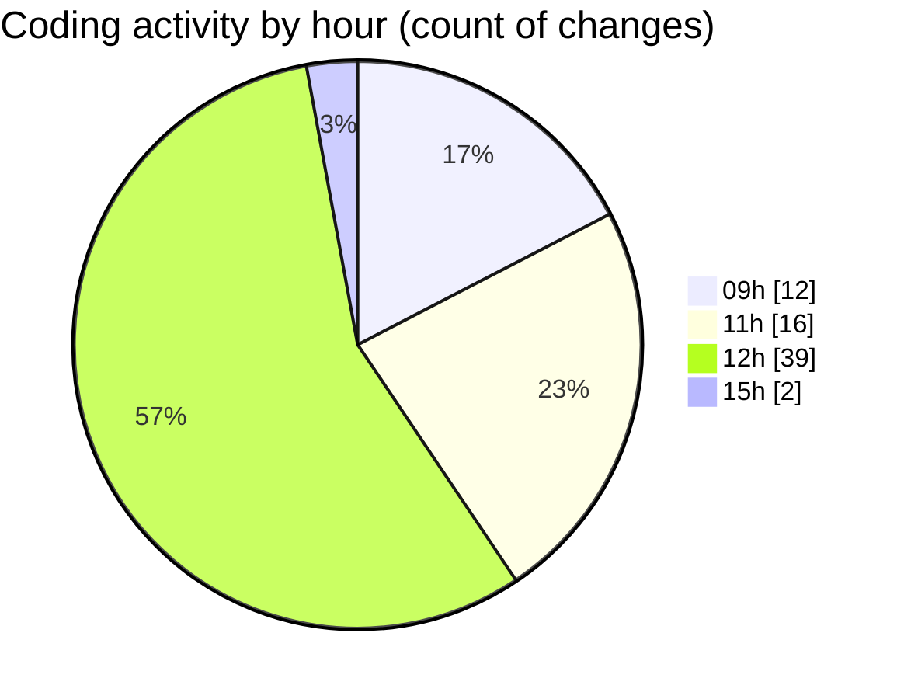

# mbc-web - Activity Summary 

## Overall Statistics

| Stat                   | Value                                                             |
| ---------------------- | ----------------------------------------------------------------- |
| **Lines Added** (➕)   | 3245                                          |
| **Lines Removed** (➖) | 89                                        |
| **Net Change** (↕)    | 3156                |
| **Active Time** (⌚)   | 77 minutes |

## Modified Files
- **httpClient.ts** (+50, -8)
- **axiosConfig.ts** (+65, -36)
- **package.json** (+148, -1)
- **useUsuarios.ts** (+29, -2)
- **index.lazy.tsx** (+52, -0)
- **ServerAPI.ts** (+149, -6)
- **AbstractApiClient.ts** (+146, -1)
- **index.lazy.tsx** (+68, -7)
- **RenderInputField.tsx** (+386, -0)
- **RenderViewField.tsx** (+146, -0)
- **index.lazy.tsx** (+61, -0)
- **-config.tsx** (+191, -3)
- **index.lazy.tsx** (+103, -0)
- **index.tsx** (+460, -0)
- **index.lazy.tsx** (+123, -0)
- **index.lazy.tsx** (+125, -0)
- **CrudRecordForm.tsx** (+470, -0)
- **login.lazy.tsx** (+130, -18)
- **UsuariosAPI.ts** (+113, -0)
- **types.ts** (+187, -0)
- **tsconfig.app.tsbuildinfo** (+2, -0)
- **useAuthentication.ts** (+24, -7)
- **useLeads.ts** (+17, -0)

## Visualizations

### By File Type (Lines Changed)

### By Hour (Estimated Activity Count)

> **Last Updated:** 20/02/2025, 15:34:21