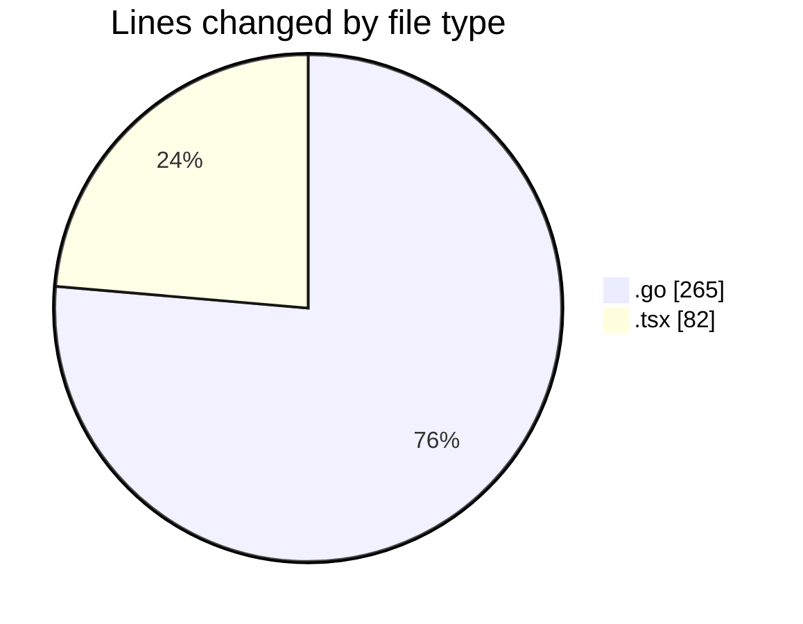
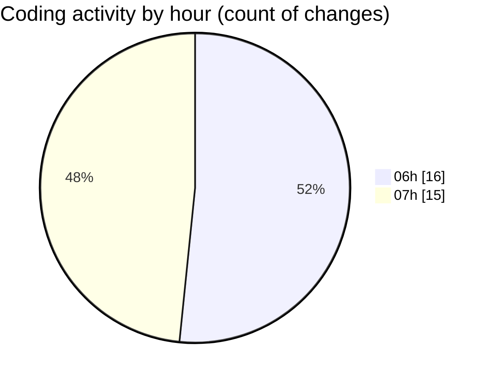

# termonied_testador - Activity Summary 

## Overall Statistics

| Stat                   | Value                                                             |
| ---------------------- | ----------------------------------------------------------------- |
| **Lines Added** (➕)   | 334                                          |
| **Lines Removed** (➖) | 13                                        |
| **Net Change** (↕)    | 321                |
| **Active Time** (⌚)   | 43 minutes |

## Modified Files
- **serial.go** (+50, -0)
- **queue.go** (+51, -0)
- **command.go** (+21, -1)
- **estacao.go** (+54, -2)
- **app.go** (+46, -1)
- **main.go** (+39, -0)
- **App.tsx** (+73, -9)

## Visualizations

### By File Type (Lines Changed)

### By Hour (Estimated Activity Count)

> **Last Updated:** 21/02/2025, 07:36:23