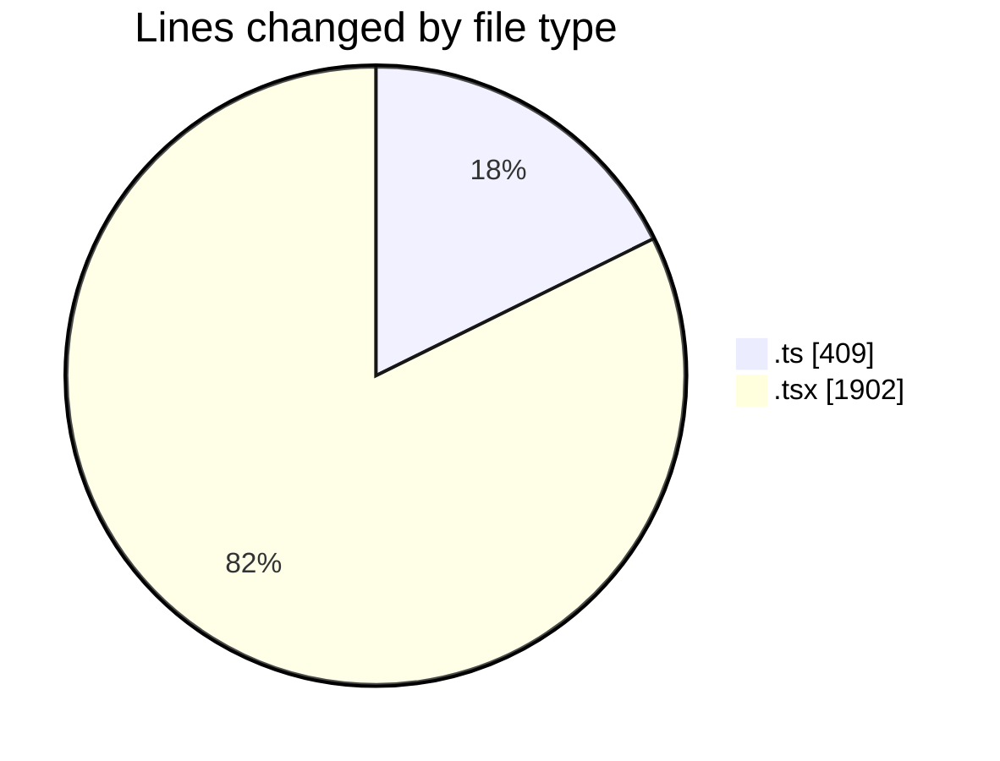
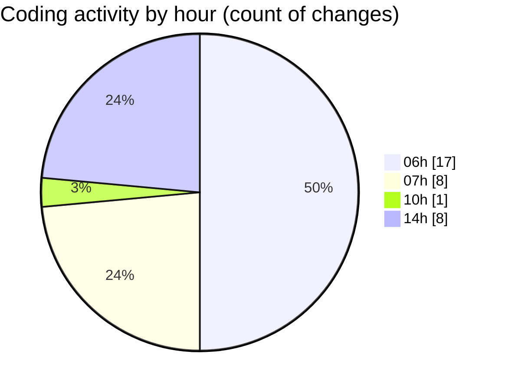

# mbc-web - Activity Summary 

## Overall Statistics

| Stat                   | Value                                                             |
| ---------------------- | ----------------------------------------------------------------- |
| **Lines Added** (➕)   | 2087                                          |
| **Lines Removed** (➖) | 224                                        |
| **Net Change** (↕)    | 1863                |
| **Active Time** (⌚)   | 52 minutes |

## Modified Files
- **ProdutosAPI.ts** (+211, -131)
- **useProdutos.ts** (+28, -2)
- **index.lazy.tsx** (+131, -78)
- **-config.tsx** (+612, -13)
- **index.lazy.tsx** (+51, -0)
- **-config.tsx** (+867, -0)
- **index.lazy.tsx** (+48, -0)
- **AppSidebar.tsx** (+102, -0)
- **ClientesAPI.ts** (+37, -0)

## Visualizations

### By File Type (Lines Changed)

### By Hour (Estimated Activity Count)

> **Last Updated:** 25/02/2025, 15:00:39