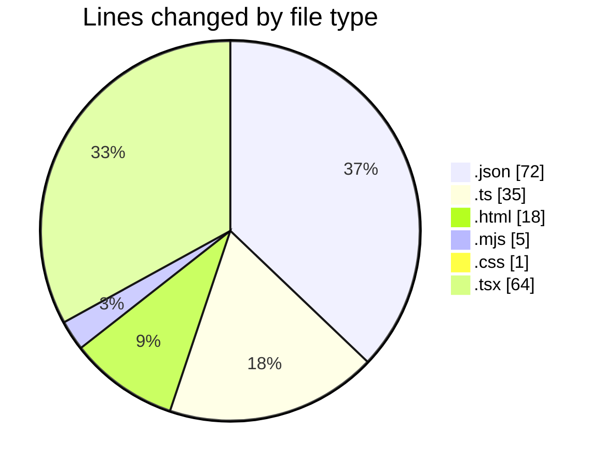
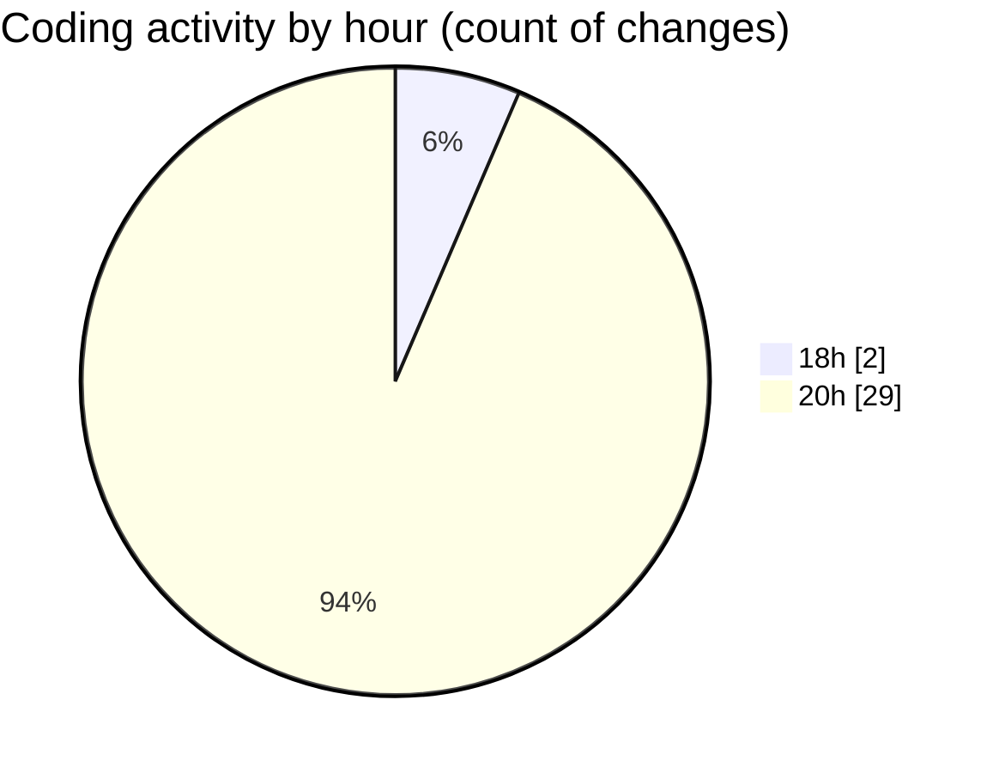

# area-formacao-web - Activity Summary 

## Overall Statistics

| Stat                   | Value                                                             |
| ---------------------- | ----------------------------------------------------------------- |
| **Lines Added** (➕)   | 191                                          |
| **Lines Removed** (➖) | 4                                        |
| **Net Change** (↕)    | 187                |
| **Active Time** (⌚)   | 32 minutes |

## Modified Files
- **package.json** (+34, -0)
- **rsbuild.config.ts** (+28, -0)
- **index.html** (+17, -1)
- **postcss.config.mjs** (+5, -0)
- **index.css** (+1, -0)
- **main.tsx** (+26, -0)
- **index.tsx** (+35, -3)
- **tsconfig.json** (+16, -0)
- **utils.ts** (+7, -0)
- **components.json** (+22, -0)

## Visualizations

### By File Type (Lines Changed)

### By Hour (Estimated Activity Count)

> **Last Updated:** 26/02/2025, 20:51:38