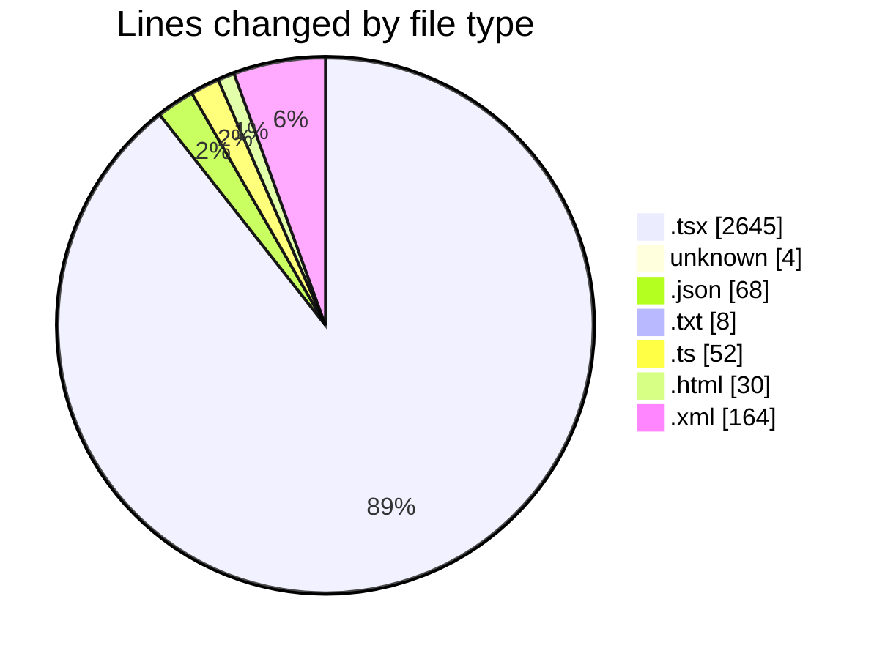
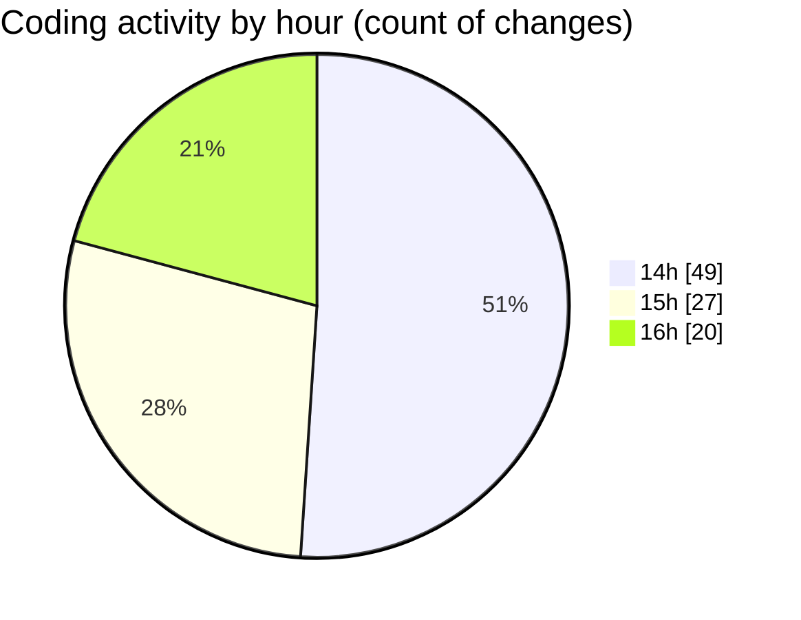

# audiobooks-web - Activity Summary 

## Overall Statistics

| Stat                   | Value                                                             |
| ---------------------- | ----------------------------------------------------------------- |
| **Lines Added** (➕)   | 2761                                          |
| **Lines Removed** (➖) | 210                                        |
| **Net Change** (↕)    | 2551                |
| **Active Time** (⌚)   | 113 minutes |

## Modified Files
- **input.tsx** (+111, -0)
- **MainContent.tsx** (+72, -26)
- **__root.tsx** (+51, -20)
- **index.tsx** (+42, -21)
- **index.tsx** (+52, -21)
- **$livro.tsx** (+207, -21)
- **$jornada.tsx** (+207, -16)
- **.env** (+3, -1)
- **package.json** (+68, -0)
- **robots.txt** (+4, -0)
- **vite.config.ts** (+39, -13)
- **index.html** (+30, -0)
- **sitemap.xml** (+99, -65)
- **robots.txt** (+4, -0)
- **ContentCard.tsx** (+186, -1)
- **CreateAccount.tsx** (+83, -0)
- **CarouselBooks.tsx** (+179, -0)
- **FormLogin.tsx** (+122, -0)
- **Footer.tsx** (+76, -0)
- **Header.tsx** (+109, -0)
- **Sidebar.tsx** (+74, -0)
- **LoginForm.tsx** (+118, -0)
- **index.tsx** (+691, -5)
- **ContentListSection.tsx** (+134, -0)

## Visualizations

### By File Type (Lines Changed)

### By Hour (Estimated Activity Count)

> **Last Updated:** 27/02/2025, 16:28:22