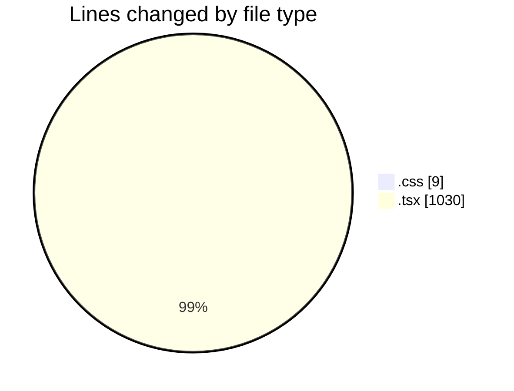
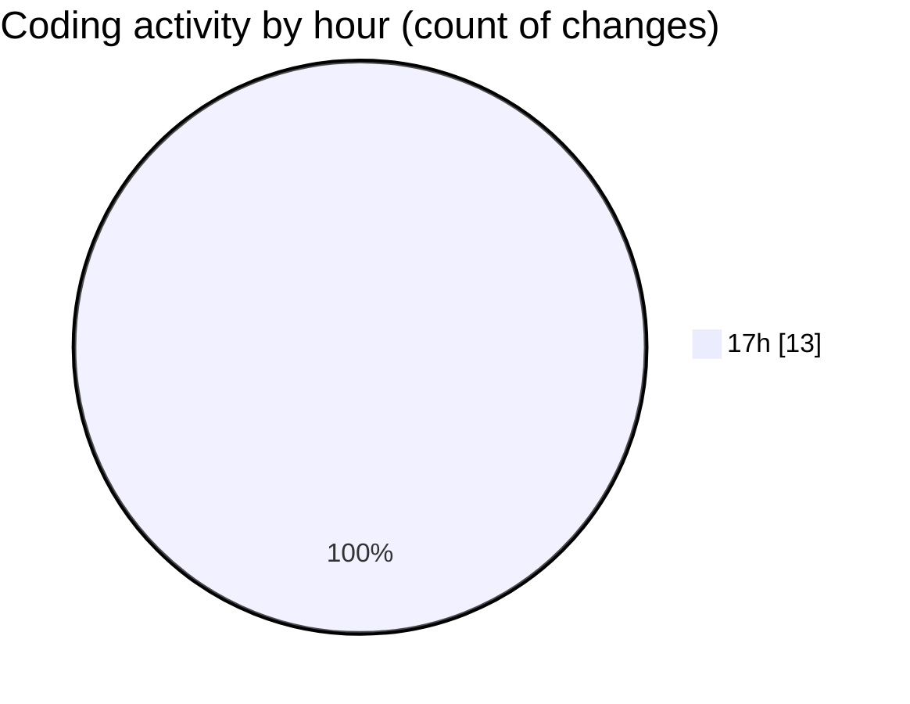

# audiobooks-web - Activity Summary 

## Overall Statistics

| Stat                   | Value                                                             |
| ---------------------- | ----------------------------------------------------------------- |
| **Lines Added** (➕)   | 1033                                          |
| **Lines Removed** (➖) | 6                                        |
| **Net Change** (↕)    | 1027                |
| **Active Time** (⌚)   | 15 minutes |

## Modified Files
- **VolumeSlider.module.css** (+9, -0)
- **VolumeSlider.tsx** (+34, -0)
- **$livro.tsx** (+201, -6)
- **$jornada.tsx** (+199, -0)
- **ContentCard.tsx** (+185, -0)
- **$livro-$slug.tsx** (+226, -0)
- **CarouselBooks.tsx** (+179, -0)

## Visualizations

### By File Type (Lines Changed)

### By Hour (Estimated Activity Count)

> **Last Updated:** 28/02/2025, 17:51:26