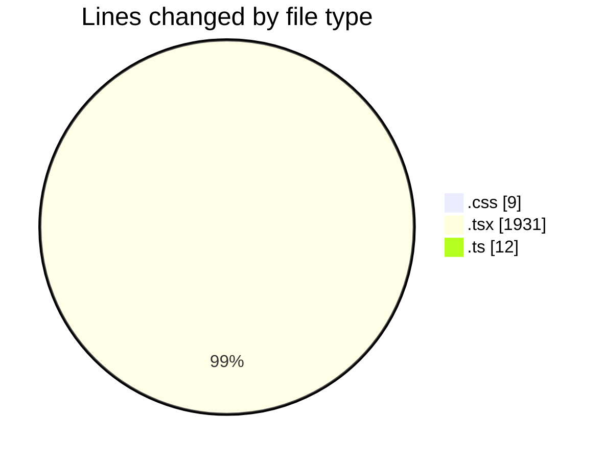
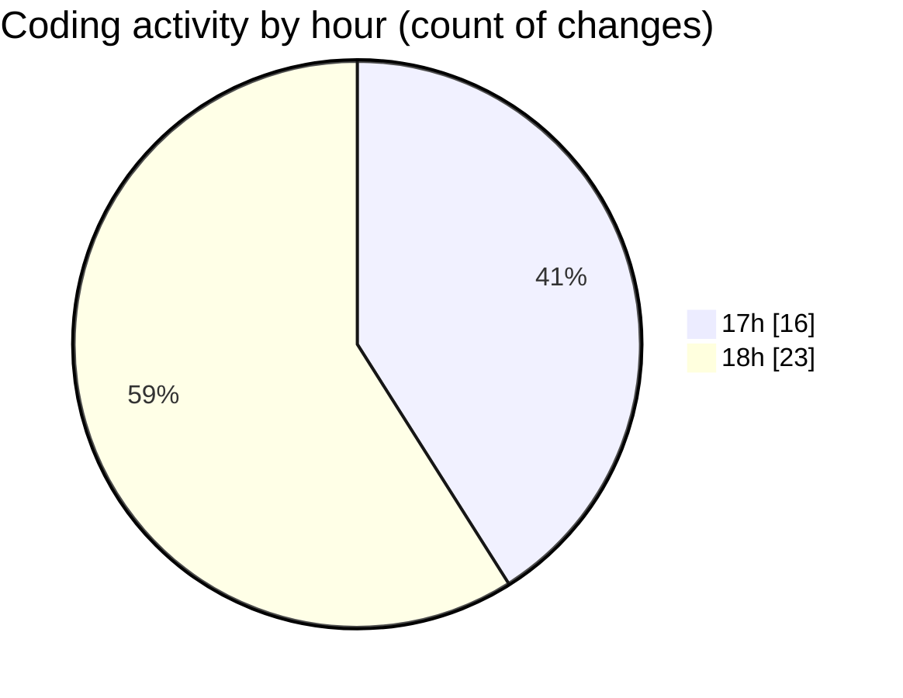

# audiobooks-web - Activity Summary 

## Overall Statistics

| Stat                   | Value                                                             |
| ---------------------- | ----------------------------------------------------------------- |
| **Lines Added** (➕)   | 1945                                          |
| **Lines Removed** (➖) | 7                                        |
| **Net Change** (↕)    | 1938                |
| **Active Time** (⌚)   | 57 minutes |

## Modified Files
- **VolumeSlider.module.css** (+9, -0)
- **VolumeSlider.tsx** (+34, -0)
- **$livro.tsx** (+239, -7)
- **$jornada.tsx** (+199, -0)
- **ContentCard.tsx** (+185, -0)
- **$livro-$slug.tsx** (+227, -0)
- **CarouselBooks.tsx** (+180, -0)
- **slug.ts** (+12, -0)
- **index.tsx** (+762, -0)
- **Playlist.tsx** (+7, -0)
- **PlaylistPanel.tsx** (+89, -0)
- **Player.tsx** (+1, -0)
- **PlayerControls.tsx** (+1, -0)

## Visualizations

### By File Type (Lines Changed)

### By Hour (Estimated Activity Count)

> **Last Updated:** 28/02/2025, 18:36:26