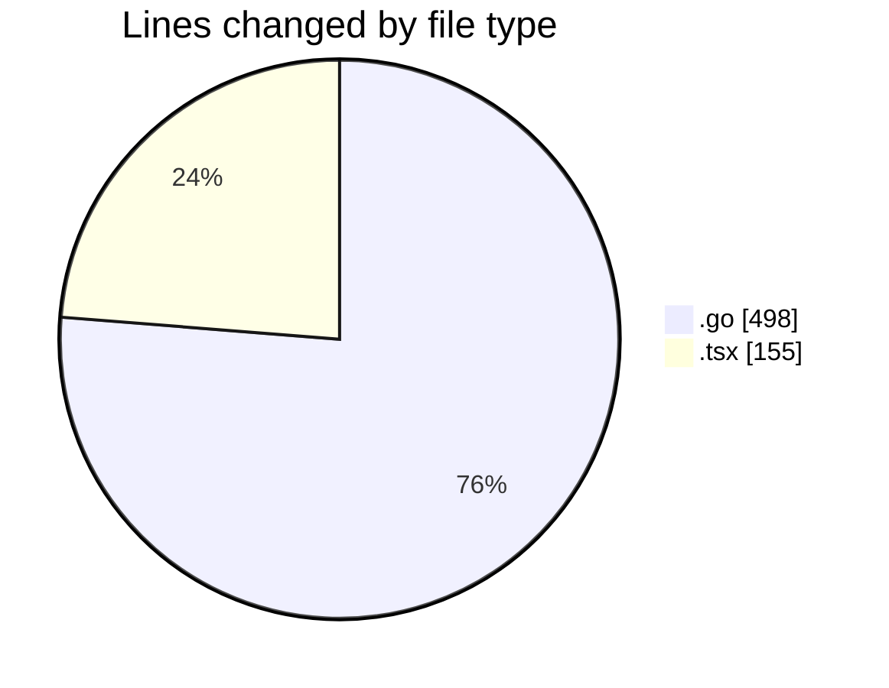

# termonied_testador - Activity Summary 

## Overall Statistics

| Stat                   | Value                                                             |
| ---------------------- | ----------------------------------------------------------------- |
| **Lines Added** (➕)   | 613                                          |
| **Lines Removed** (➖) | 40                                        |
| **Net Change** (↕)    | 573                |
| **Active Time** (⌚)   | 23 minutes |

## Modified Files
- **serial.go** (+110, -0)
- **command.go** (+30, -0)
- **queue.go** (+142, -0)
- **app.go** (+50, -0)
- **service.go** (+42, -40)
- **App.tsx** (+155, -0)
- **estacao.go** (+84, -0)

## Visualizations

### By File Type (Lines Changed)

### By Hour (Estimated Activity Count)

> **Last Updated:** 01/03/2025, 14:41:19