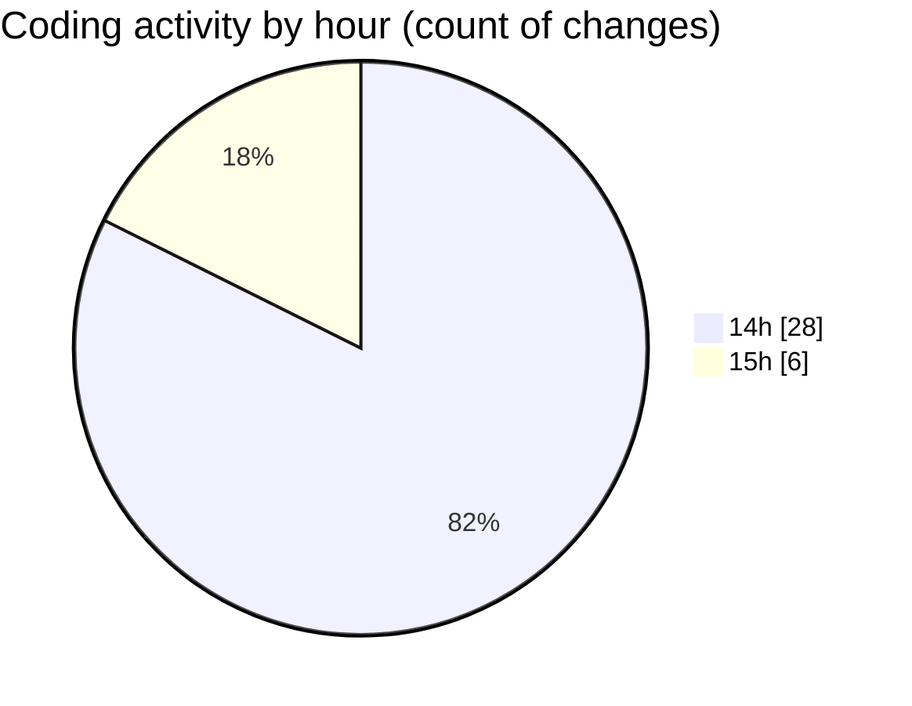

# termonied_testador - Activity Summary 

## Overall Statistics

| Stat                   | Value                                                             |
| ---------------------- | ----------------------------------------------------------------- |
| **Lines Added** (➕)   | 939                                          |
| **Lines Removed** (➖) | 63                                        |
| **Net Change** (↕)    | 876                |
| **Active Time** (⌚)   | 50 minutes |

## Modified Files
- **serial.go** (+110, -23)
- **command.go** (+30, -0)
- **queue.go** (+184, -0)
- **app.go** (+59, -0)
- **service.go** (+42, -40)
- **App.tsx** (+305, -0)
- **estacao.go** (+84, -0)
- **aeracao.go** (+84, -0)
- **main.go** (+41, -0)

## Visualizations

### By File Type (Lines Changed)

### By Hour (Estimated Activity Count)

> **Last Updated:** 01/03/2025, 15:11:19