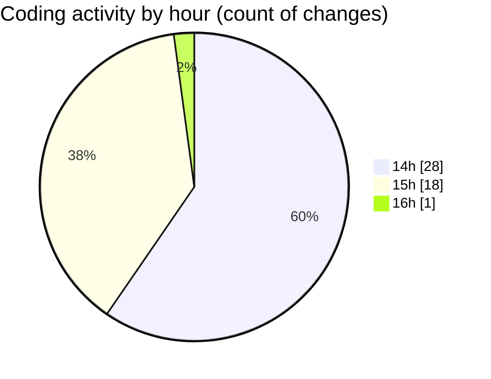

# termonied_testador - Activity Summary 

## Overall Statistics

| Stat                   | Value                                                             |
| ---------------------- | ----------------------------------------------------------------- |
| **Lines Added** (➕)   | 984                                          |
| **Lines Removed** (➖) | 82                                        |
| **Net Change** (↕)    | 902                |
| **Active Time** (⌚)   | 75 minutes |

## Modified Files
- **serial.go** (+124, -23)
- **command.go** (+32, -0)
- **queue.go** (+201, -17)
- **app.go** (+63, -0)
- **service.go** (+42, -40)
- **App.tsx** (+309, -2)
- **estacao.go** (+86, -0)
- **aeracao.go** (+86, -0)
- **main.go** (+41, -0)

## Visualizations

### By File Type (Lines Changed)

### By Hour (Estimated Activity Count)

> **Last Updated:** 01/03/2025, 16:01:19