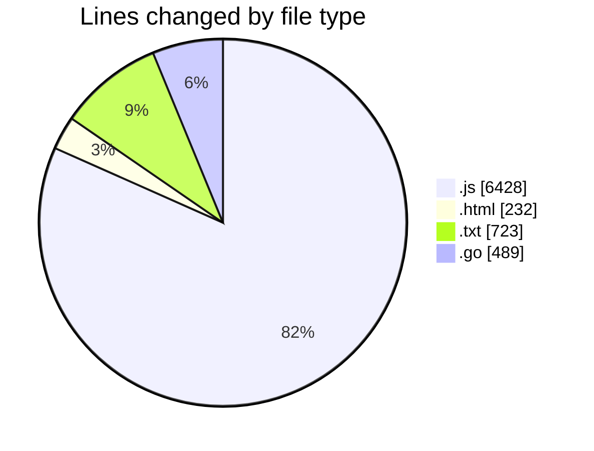
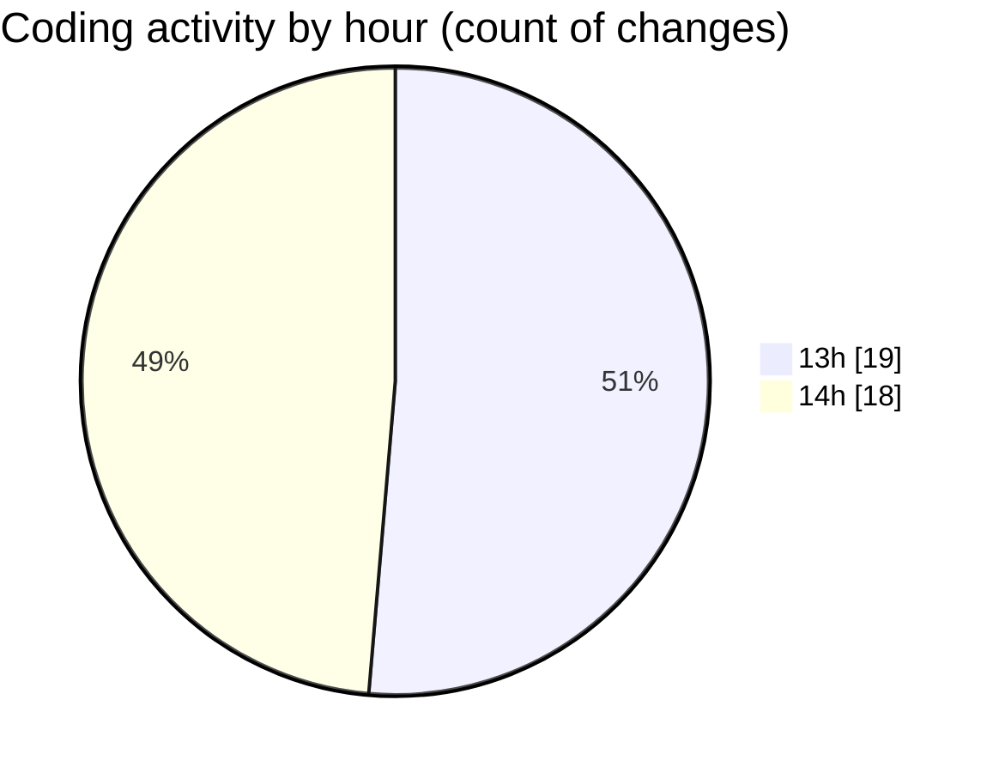

# kart-online - Activity Summary 

## Overall Statistics

| Stat                   | Value                                                             |
| ---------------------- | ----------------------------------------------------------------- |
| **Lines Added** (➕)   | 6498                                          |
| **Lines Removed** (➖) | 1374                                        |
| **Net Change** (↕)    | 5124                |
| **Active Time** (⌚)   | 40 minutes |

## Modified Files
- **game-js.js** (+1377, -1374)
- **game.js** (+351, -0)
- **assetLoader.js** (+275, -0)
- **kart.js** (+341, -0)
- **physics.js** (+242, -0)
- **audio.js** (+86, -0)
- **track.js** (+269, -0)
- **ai.js** (+220, -0)
- **network.js** (+250, -0)
- **index-v2.html** (+232, -0)
- **core.js** (+1377, -0)
- **guia.txt** (+723, -0)
- **placeholders.js** (+99, -0)
- **textureLoader.js** (+102, -0)
- **audioGenerator.js** (+65, -0)
- **server.go** (+489, -0)

## Visualizations

### By File Type (Lines Changed)

### By Hour (Estimated Activity Count)

> **Last Updated:** 03/03/2025, 14:10:03