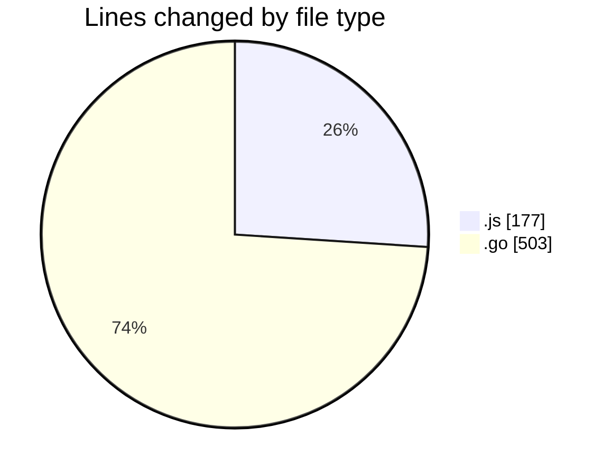
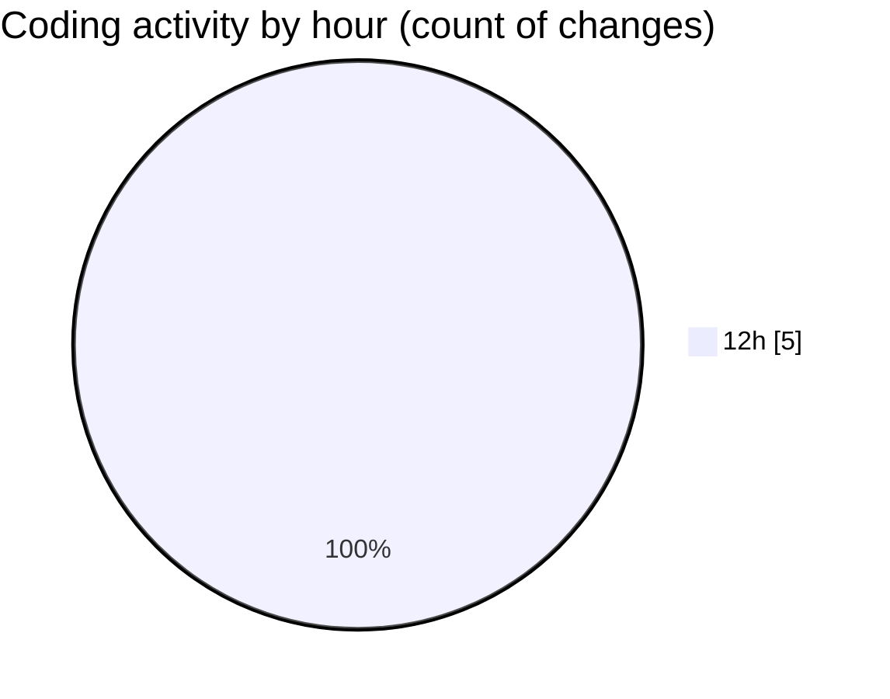

# simulador-serial - Activity Summary 

## Overall Statistics

| Stat                   | Value                                                             |
| ---------------------- | ----------------------------------------------------------------- |
| **Lines Added** (➕)   | 679                                          |
| **Lines Removed** (➖) | 1                                        |
| **Net Change** (↕)    | 678                |
| **Active Time** (⌚)   | 6 minutes |

## Modified Files
- **simulador.js** (+176, -1)
- **serial.go** (+503, -0)

## Visualizations

### By File Type (Lines Changed)

### By Hour (Estimated Activity Count)

> **Last Updated:** 04/03/2025, 12:45:30