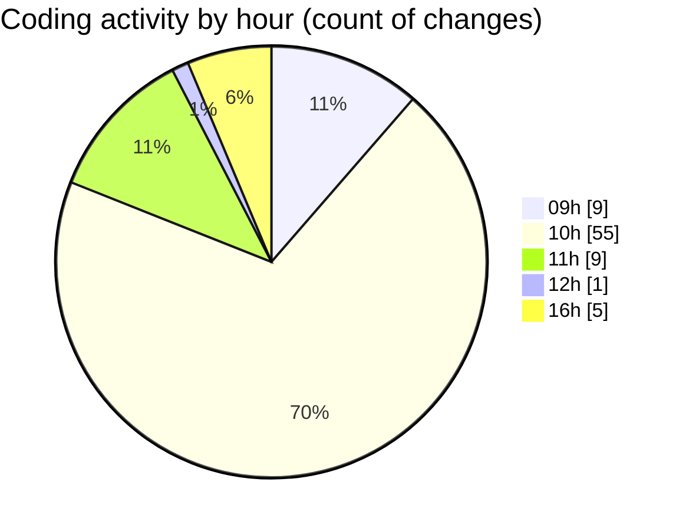

# termonied_testador - Activity Summary 

## Overall Statistics

| Stat                   | Value                                                             |
| ---------------------- | ----------------------------------------------------------------- |
| **Lines Added** (➕)   | 942                                          |
| **Lines Removed** (➖) | 206                                        |
| **Net Change** (↕)    | 736                |
| **Active Time** (⌚)   | 121 minutes |

## Modified Files
- **App.tsx** (+30, -184)
- **History.tsx** (+180, -8)
- **estacao.go** (+164, -5)
- **serial.go** (+371, -9)
- **Service.js** (+16, -0)
- **Aeracao.tsx** (+95, -0)
- **models.ts** (+86, -0)

## Visualizations

### By File Type (Lines Changed)

### By Hour (Estimated Activity Count)

> **Last Updated:** 04/03/2025, 16:12:21