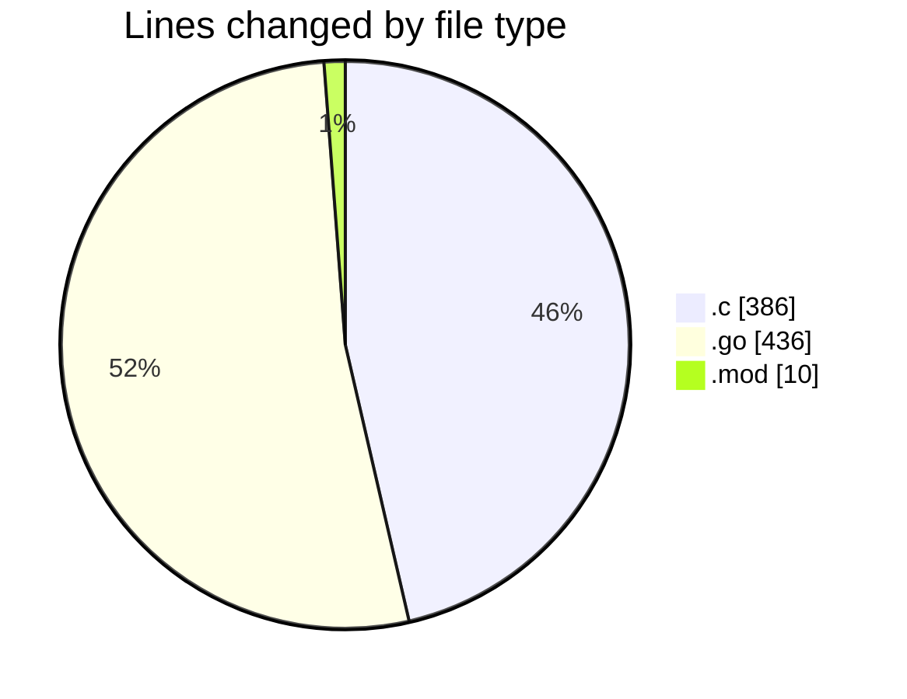
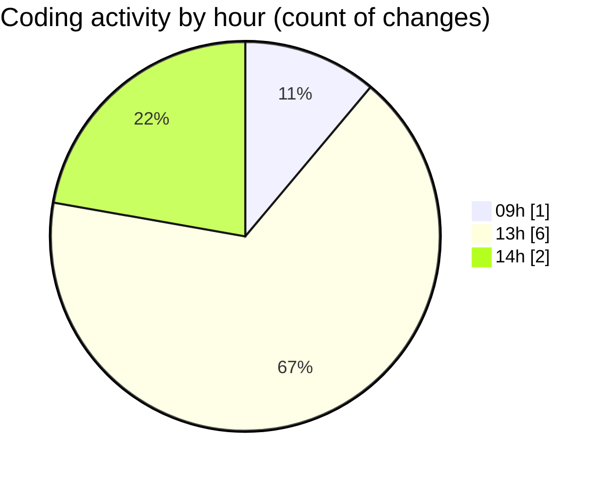

# termoa-central - Activity Summary 

## Overall Statistics

| Stat                   | Value                                                             |
| ---------------------- | ----------------------------------------------------------------- |
| **Lines Added** (➕)   | 791                                          |
| **Lines Removed** (➖) | 41                                        |
| **Net Change** (↕)    | 750                |
| **Active Time** (⌚)   | 12 minutes |

## Modified Files
- **estacao.c** (+386, -0)
- **serial.go** (+367, -41)
- **serial_test.go** (+28, -0)
- **go.mod** (+10, -0)

## Visualizations

### By File Type (Lines Changed)

### By Hour (Estimated Activity Count)

> **Last Updated:** 05/03/2025, 14:02:54